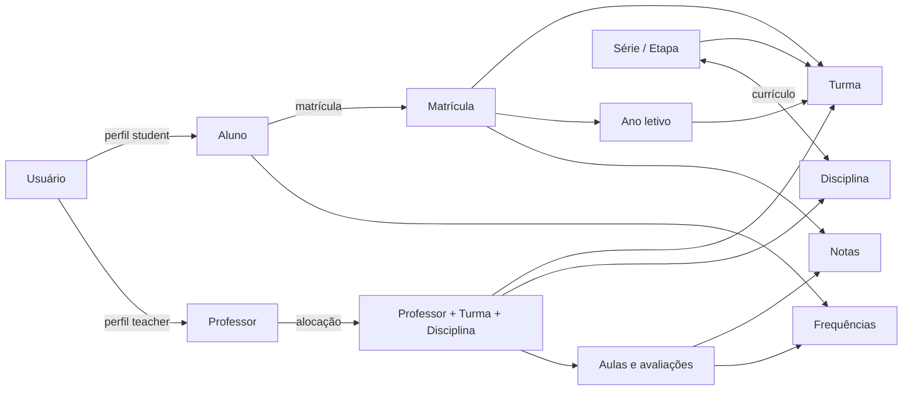

# Análise geral e fluxos de cadastro do Lumina ERP

> Análise técnica e funcional baseada no código-fonte em 23 de agosto de 2026.
> O documento descreve o comportamento atual do sistema, não apenas a arquitetura pretendida.

## 1. Resumo executivo

O Lumina ERP é um ERP escolar em estágio de MVP avançado, construído com Laravel 12, Filament 4 e Spatie Permission. O sistema concentra a administração e os portais de aluno e professor em uma única aplicação web, no painel Filament identificado como `lumina` e publicado em `/lumina`.

O núcleo implementado cobre:

- usuários, perfis e permissões;
- alunos e professores;
- séries ou etapas de ensino;
- disciplinas e sua associação às séries;
- anos letivos e períodos avaliativos;
- turmas e disciplinas ofertadas;
- alocação de professores por turma e disciplina;
- matrículas, documentos e histórico de operações;
- aulas, avaliações, notas e frequências;
- painéis específicos para administrador, professor e aluno.

O domínio central pode ser resumido assim:



O sistema está funcional para uma operação acadêmica básica, mas ainda possui inconsistências entre os diferentes caminhos de cadastro, dois padrões de permissões coexistindo e alguns pontos de autorização que precisam ser endurecidos antes de uso em produção.

## 2. Arquitetura atual

### 2.1 Tecnologias

| Camada | Implementação atual |
|---|---|
| Backend | PHP 8.2+ e Laravel 12 |
| Interface | Filament 4, Livewire e Blade |
| Autenticação | Guard web do Laravel e login do Filament |
| Autorização | Policies, Spatie Permission e verificações próprias |
| Banco | MySQL 8 no ambiente Docker |
| Arquivos | Storage do Laravel para avatares, fotos e documentos |
| PDFs | DomPDF |
| Infraestrutura | Docker Compose, nginx, PHP-FPM e Makefile |

Não foi encontrada uma API pública implementada. As rotas de negócio atuais são páginas Filament e rotas autenticadas de geração de PDFs de matrícula.

### 2.2 Organização do painel

Existe um único `AdminPanelProvider`, apesar de o painel atender três experiências:

- painel administrativo;
- portal do professor;
- portal do aluno.

Todas as páginas e recursos sob `app/Filament` são descobertos pelo mesmo painel. A separação ocorre por `shouldRegisterNavigation()`, `canAccess()`, policies, papel do usuário e permissões.

Ao acessar a raiz `/lumina`, o middleware `RedirectUserByRole` direciona:

| Perfil | Destino |
|---|---|
| `admin` | `/lumina/dashboard-admin` |
| `teacher` | `/lumina/dashboard-teacher` |
| `student` | `/lumina/dashboard-student` |

Os papéis `ti`, `secretaria` e `financeiro` não possuem redirecionamento explícito nesse middleware.

### 2.3 Perfis de acesso

Os seeders criam os seguintes papéis:

| Papel | Finalidade observada |
|---|---|
| `ti` | Acesso administrativo amplo e gestão técnica |
| `admin` | Alias de acesso amplo, mantido por compatibilidade |
| `secretaria` | Operação acadêmica e leitura limitada de usuários |
| `financeiro` | Matrículas e consultas acadêmicas necessárias ao financeiro |
| `teacher` | Portal e operações do próprio professor |
| `student` | Portal e dados do próprio aluno |

O acesso ao painel também exige usuário ativo e não bloqueado. Após cinco tentativas de login malsucedidas, o modelo prevê bloqueio. Em um login bem-sucedido, as tentativas são zeradas e `last_login_at` é atualizado.

As permissões `student.*` e `teacher.*` são contextuais: além da permissão, o usuário deve possuir respectivamente o papel `student` ou `teacher`. Isso impede que o administrador assuma acidentalmente os portais pessoais apenas por possuir permissões globais.

## 3. Módulos e responsabilidades

### 3.1 Administração e segurança

- cadastro e manutenção de usuários;
- ativação, inativação e desbloqueio;
- geração de senha temporária;
- papéis e permissões;
- matriz de permissões organizada por módulos.

### 3.2 Estrutura acadêmica

- séries ou etapas, com etapa educacional e ordem de exibição;
- disciplinas, incluindo código, categoria e referências BNCC;
- associação curricular entre série e disciplina;
- ano letivo, datas e status;
- períodos avaliativos e janela de lançamento de notas;
- turmas, turno, tipo, capacidade, série, ano e professor responsável.

### 3.3 Secretaria acadêmica

- cadastro completo de alunos;
- matrícula em turma;
- número de registro e número de chamada automáticos;
- trancamento, transferência, cancelamento e reativação;
- histórico auditável das operações;
- checklist e upload de documentos;
- geração de comprovantes e documentos em PDF.

### 3.4 Operação docente

- painel do professor;
- turmas e disciplinas derivadas das alocações;
- agenda de aulas;
- criação e fechamento de avaliações;
- lançamento e publicação de notas;
- registro de frequência;
- atualização de informações básicas do perfil.

O professor não escolhe livremente qualquer turma ou disciplina. O contexto é obtido de `TeacherAssignment`, que liga professor, turma e disciplina.

### 3.5 Portal do aluno

- resumo acadêmico;
- notas e boletim em PDF;
- frequência e alerta abaixo de 75%;
- disciplinas e detalhes;
- calendário acadêmico;
- avaliações próximas.

Os dados são obtidos pelo `Student` vinculado ao usuário autenticado e pela turma do ano letivo ativo.

## 4. Ordem correta de implantação e cadastros

O domínio possui dependências. Em uma base vazia, a sequência recomendada é:

1. Criar papéis e permissões.
2. Criar o primeiro usuário de TI ou administrador.
3. Cadastrar séries ou etapas.
4. Cadastrar disciplinas.
5. Associar disciplinas às séries, formando a matriz curricular.
6. Criar o ano letivo e seus períodos avaliativos.
7. Criar as turmas ligadas ao ano letivo e à série.
8. Cadastrar professores e seus usuários.
9. Alocar cada professor em uma combinação de turma e disciplina.
10. Cadastrar ou matricular alunos.
11. Gerar ou cadastrar aulas.
12. Registrar avaliações, notas e frequências.

Essa ordem também aparece nos seeders: referências acadêmicas e permissões são criadas antes dos usuários; usuários antes de turmas e alocações; turmas e matrículas antes de aulas, frequências e notas.

## 5. Fluxos de cadastro existentes

### 5.1 Cadastro de usuário

Menu: **Usuários**.

O formulário recebe identificação, e-mail, senha, papel, situação, dados pessoais, foto e endereço. Na criação:

1. o usuário é salvo com troca de senha inicialmente obrigatória;
2. tentativas e bloqueio são zerados;
3. o papel selecionado é sincronizado;
4. se o papel for `student`, um registro mínimo de `Student` é criado;
5. se o papel for `teacher`, um registro mínimo de `Teacher` é criado.

Resultado por papel:

| Papel escolhido | Registros gerados |
|---|---|
| Administrativo | `users` + papel |
| Aluno | `users` + papel + `students` mínimo |
| Professor | `users` + papel + `teachers` mínimo |

Depois disso, os dados acadêmicos específicos ainda devem ser completados no cadastro de aluno ou professor. Para o aluno, também é necessário realizar uma matrícula; criar o usuário não o coloca em uma turma.

Na edição, o administrador ou TI pode redefinir senha, desbloquear, inativar e reativar o usuário. A inativação do usuário impede acesso ao painel.

### 5.2 Cadastro direto de aluno

Menu: **Alunos**.

O cadastro contempla identificação, CPF, RG, contato, endereço, nascimento, responsáveis, saúde, transporte e situação. O modelo gera automaticamente:

- UUID;
- registro no formato aproximado `ALU-AAAA-NNNNNN`.

Comportamento importante: o cadastro direto de aluno não cria automaticamente uma conta em `users`. O aluno poderá existir como pessoa acadêmica sem acesso ao portal até que seja matriculado pelo fluxo que cria usuário ou até que uma conta seja criada e vinculada por outro caminho.

### 5.3 Cadastro direto de professor

Menu: **Professores**.

O cadastro guarda dados pessoais e profissionais, como matrícula funcional, titulação, regime, carga horária e status.

Comportamento importante: o cadastro direto de professor não cria automaticamente usuário. Sem `user_id` e papel `teacher`, o professor não consegue acessar o portal. Após o cadastro, também é indispensável criar ao menos uma alocação para que suas turmas e disciplinas apareçam.

### 5.4 Cadastro de aluno pela matrícula — fluxo mais completo

Menu: **Matrículas → Nova matrícula**.

O assistente permite selecionar um aluno existente ou cadastrar um novo. Para um novo aluno, coleta:

- identificação e contato;
- endereço, com consulta opcional ao ViaCEP e localidades do IBGE;
- responsáveis;
- informações de saúde e transporte;
- ano letivo, turma, data, número de chamada e status.

Ao concluir:

1. cria o aluno, quando necessário;
2. verifica se já existe matrícula do aluno na turma;
3. cria a matrícula;
4. herda o ano letivo da turma quando necessário;
5. sugere o próximo número de chamada;
6. gera um número de matrícula anual após obter o ID;
7. registra um log de criação;
8. se o aluno não tiver usuário, cria uma conta ativa com papel `student`;
9. copia as permissões do papel de aluno para o usuário.

Este é atualmente o caminho mais próximo de um onboarding completo do aluno, pois produz aluno, matrícula e acesso ao portal.

Há, entretanto, uma ressalva: a senha inicial é aleatória e não é exibida. A mensagem orienta o aluno a usar “Esqueci minha senha”, mas o painel está configurado apenas com `login()` e não foi localizada habilitação explícita de recuperação de senha. Esse fluxo deve ser validado antes do uso real.

### 5.5 Matrícula de aluno existente

Há três pontos de entrada observados:

- assistente em **Matrículas**;
- relação de matrículas dentro da edição do aluno;
- ação **Vincular Aluno** na listagem de turmas.

A matrícula liga `student_id`, `class_id` e `school_year_id`, mantendo data, status, número de chamada e número de registro. O domínio calcula capacidade e ocupação da turma e considera matrículas ativas, suspensas ou trancadas como ocupação.

O fluxo principal impede duplicação do mesmo aluno na mesma turma. A regra de uma matrícula ativa por ano letivo também aparece na validação do formulário e nas constraints das migrations; os caminhos alternativos devem ser mantidos alinhados com essas mesmas regras.

### 5.6 Ano letivo e períodos

Menu: **Configurações Acadêmicas → Ano Letivo**.

O ano possui data inicial, final e status. Apenas um ano pode permanecer ativo: ao ativar um, os outros anos ativos voltam para planejamento. Os períodos relacionados controlam sequência, datas e janela de lançamento de notas.

O ano ativo é uma dependência direta dos dashboards, matrículas sugeridas e consultas acadêmicas.

### 5.7 Série, disciplina e currículo

Primeiro são cadastradas as séries/etapas e as disciplinas. Em seguida, a relação entre ambas define o currículo, podendo carregar informações pedagógicas adicionais na tabela de associação.

Essa associação deve anteceder a criação operacional das turmas e alocações para reduzir combinações inválidas.

### 5.8 Turma

Menu: **Turmas**.

A turma pertence a um ano letivo e uma série. Também guarda código, nome, turno, tipo, status, capacidade e professor responsável opcional.

Uma turma se relaciona com:

- alunos, por meio de matrículas;
- disciplinas, pela tabela `class_subjects`;
- professores e disciplinas, por meio das alocações.

### 5.9 Alocação de professor

Menu: **Configurações Acadêmicas → Alocação de Professores**.

Cada registro representa a combinação:

```text
Professor + Turma + Disciplina
```

Ao criar uma alocação, o sistema anexa automaticamente a disciplina à turma se ela ainda não estiver presente. Ao excluir a última alocação daquela disciplina, remove a disciplina da turma. Há uma restrição de unicidade para evitar a repetição da mesma combinação.

Esse cadastro é a principal fronteira de dados do portal do professor: turmas, disciplinas, avaliações, notas e frequências são filtradas pelas alocações do professor autenticado.

### 5.10 Operação da matrícula

Na edição da matrícula existem ações específicas para mudanças de situação. Elas devem ser preferidas à simples alteração do campo de status porque registram operador, estado anterior, novo estado, observação e IP.

As operações implementadas incluem:

- trancamento, com motivo e prazo;
- reativação;
- transferência interna para outra turma;
- transferência externa;
- cancelamento;
- emissão de documentos em PDF.

Também existem relações para histórico e documentos entregues, incluindo arquivo digital opcional.

## 6. Fluxo operacional após os cadastros

### Professor

1. O usuário entra com papel `teacher`.
2. O sistema resolve o `Teacher` por `user_id`.
3. Carrega as alocações do professor.
4. A partir delas, limita turmas, disciplinas, aulas e avaliações.
5. O professor registra frequência e notas conforme suas permissões.
6. As notas publicadas e frequências ficam disponíveis ao aluno correspondente.

Sem professor vinculado ou sem alocações, o portal apresenta contexto vazio ou mensagem de ausência de vínculos.

### Aluno

1. O usuário entra com papel `student`.
2. O sistema resolve o `Student` por `user_id`.
3. Localiza a turma ligada ao ano letivo ativo.
4. Agrega disciplinas, aulas, avaliações, notas e frequências.
5. Exibe resumo e permite emitir o boletim quando autorizado.

Sem aluno vinculado, matrícula ou turma no ano ativo, o portal permanece sem dados acadêmicos.

## 7. Regras automáticas relevantes

- UUIDs são preenchidos automaticamente nos modelos baseados em `BaseModel` que invocam essa rotina.
- O registro acadêmico do aluno é gerado automaticamente.
- O número da matrícula é gerado depois da criação, usando ano e ID.
- O número de chamada sugerido é o maior da turma mais um.
- Apenas um ano letivo fica ativo.
- A alocação docente sincroniza disciplinas da turma.
- Nota vinculada a uma matrícula herda o aluno quando ele não for informado.
- Frequência considera presença e atraso como comparecimento.
- Frequência inferior a 75% produz alerta.
- Usuário inativo ou bloqueado não acessa o Filament.
- Aluno com matrículas e professor com alocações possuem restrições de exclusão nas policies.

## 8. Análise de consistência e riscos

### Prioridade alta

1. **Unificar o onboarding de aluno e professor.** Há caminhos que criam somente a entidade, outros criam usuário mais entidade e o assistente de matrícula cria aluno, matrícula e usuário. Isso pode gerar registros sem acesso, vínculos incompletos e suporte operacional difícil.
2. **Validar a entrega da senha inicial.** O fluxo de matrícula gera senha aleatória não comunicada e depende de recuperação de senha aparentemente não habilitada.
3. **Autorizar as rotas de PDF por registro.** As rotas exigem autenticação, mas não demonstram middleware de permissão ou policy na definição da rota. Um usuário autenticado não deve obter documento de matrícula apenas conhecendo o ID.
4. **Consolidar permissões.** Recursos administrativos usam nomes como `students.view`, enquanto a matriz nova contém `academic.students.view_any`, `academic.students.create` etc. Os dois catálogos coexistem, e alterar a matriz pode não alterar efetivamente a autorização do Resource correspondente.

### Prioridade média

5. **Definir painel inicial para todos os papéis.** `ti`, `secretaria` e `financeiro` não têm destino explícito ao abrir `/lumina`.
6. **Evitar permissões duplicadas no usuário.** Em alguns fluxos, o usuário recebe o papel e também cópias diretas das permissões do papel. Isso dificulta revogação e auditoria porque uma permissão removida do papel pode continuar diretamente no usuário.
7. **Sincronizar alteração de papel e entidade.** Trocar um usuário administrativo para professor ou aluno não mostra a mesma criação explícita de entidade executada no `afterCreate()`.
8. **Revisar o papel `admin` como superadministrador do Shield.** A configuração ainda o trata como super admin irrestrito. A separação contextual dos portais reduz o problema, mas regras administrativas devem ser intencionais e testadas.
9. **Revisar caminhos alternativos de matrícula.** Wizard, relação do aluno e ação da turma devem aplicar as mesmas regras de vaga, unicidade, usuário e auditoria.

### Prioridade baixa e dívida técnica

10. A configuração `config/filament.php` referencia um `StudentPanelProvider` inexistente, enquanto o bootstrap registra apenas o painel administrativo.
11. O relacionamento `Student::students()` aparenta estar incorreto ou obsoleto, pois usa `class_id` como chave da própria entidade `Student` na tabela de matrículas.
12. O índice anterior da documentação aponta para páginas ainda inexistentes de domínio, arquitetura, API e roadmap.
13. A suíte contém um teste de exemplo que espera HTTP 200 em `/`, embora a rota deliberadamente redirecione para o login com HTTP 302.

## 9. Fluxo recomendado para a equipe operacional

Até a unificação dos cadastros, recomenda-se o seguinte procedimento:

### Novo aluno

1. Confirmar que ano letivo e turma já existem.
2. Usar **Matrículas → Nova matrícula**.
3. Escolher **Novo aluno** e preencher o assistente completo.
4. Conferir criação do usuário e definir um meio seguro de entregar ou redefinir a senha.
5. Anexar documentos e conferir o log da matrícula.

Evitar cadastrar primeiro em **Alunos** quando a intenção já for matricular e liberar o portal, pois isso adiciona uma etapa de vínculo de usuário.

### Novo professor

1. Criar o usuário em **Usuários** com papel **Professor**.
2. Completar os dados profissionais em **Professores**.
3. Criar as alocações de turma e disciplina.
4. Entrar com o usuário de teste e validar turmas, agenda e permissões.

### Novo colaborador administrativo

1. Criar o usuário em **Usuários**.
2. Selecionar exatamente um papel administrativo apropriado.
3. Revisar o papel na matriz de permissões.
4. Validar que apenas os Resources administrativos necessários aparecem.

## 10. Recomendações de evolução

Uma ordem segura de evolução seria:

1. criar um serviço transacional único para onboarding de usuário, aluno e professor;
2. definir formalmente se toda entidade acadêmica precisa ou não de usuário;
3. implementar convite ou redefinição de senha funcional e auditável;
4. escolher um único padrão de nomes de permissão e migrar Resources e policies;
5. remover permissões diretas redundantes dos usuários;
6. adicionar policies às emissões de PDF e downloads;
7. criar testes de integração para cada papel e item de navegação;
8. testar os três caminhos de matrícula contra as mesmas regras de domínio;
9. decidir entre manter um painel com navegação contextual ou separar fisicamente os painéis Filament;
10. atualizar a documentação à medida que financeiro, responsáveis e integrações forem implementados.

## 11. Arquivos de referência

Os principais pontos do código para manutenção são:

- `app/Providers/Filament/AdminPanelProvider.php`: painel e middleware;
- `app/Http/Middleware/RedirectUserByRole.php`: dashboard inicial por papel;
- `app/Filament/Resources`: cadastros administrativos;
- `app/Filament/Pages/Student`: portal do aluno;
- `app/Filament/Pages/Teacher`: portal do professor;
- `app/Support/PermissionAccess.php`: autorização contextual dos portais;
- `app/Models`: regras e relacionamentos de domínio;
- `config/lumina-permissions.php`: catálogo da matriz de permissões;
- `database/seeders`: carga inicial e ordem de dependências;
- `database/migrations`: estrutura e constraints do banco.

## 12. Conclusão

O Lumina ERP já representa bem as relações fundamentais de uma escola: estrutura curricular, ano, turma, professor, aluno, matrícula e fatos acadêmicos. Seu ponto mais forte é o fluxo de matrícula, que inclui auditoria e operações de ciclo de vida. O principal desafio atual não é falta de funcionalidades, mas uniformizar como identidades, entidades acadêmicas e permissões são criadas e mantidas.

Considerando o comportamento atual, o assistente de matrícula deve ser o fluxo padrão para novos alunos, e a criação de usuário com papel de professor deve anteceder a complementação cadastral e as alocações. A consolidação desses fluxos em serviços únicos reduzirá registros incompletos e tornará as regras mais fáceis de testar e evoluir.
