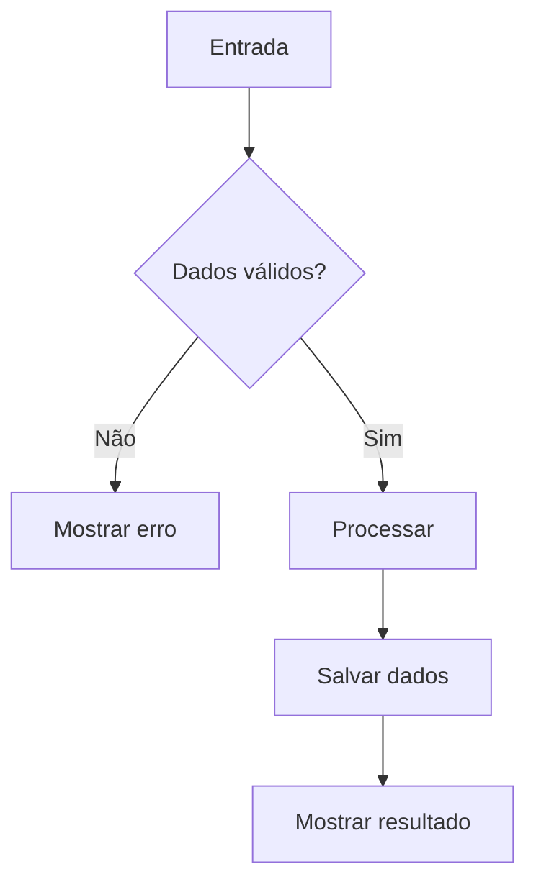

# 📘 Padrão de Documentação para GitHub, Programação e Exercícios

> Este arquivo define um padrão visual e estrutural para documentações em Markdown (`.md`), especialmente para:
>
> - exercícios de lógica e programação;
> - projetos PHP / Laravel;
> - estudos de algoritmos;
> - documentação técnica;
> - READMEs de repositórios GitHub;
> - desafios de programação;
> - documentação de APIs;
> - tarefas acadêmicas.

---

<div style="background-color:#e384d6; text-align:center; border:3px #edcae8 double; color:white; padding:8px;">
  <b>📌 PROBLEMA 01 — TÍTULO DO EXERCÍCIO</b>
</div>

---

## 🧭 Sumário

- [📖 Contexto](#-contexto)
- [🎯 Objetivo](#-objetivo)
- [🎯 Regras de Negócio](#-regras-de-negócio)
- [🛠️ Requisitos Funcionais](#️-requisitos-funcionais)
- [⚙️ Requisitos Não Funcionais](#️-requisitos-não-funcionais)
- [📥 Dados de Entrada](#-dados-de-entrada)
- [📤 Dados de Saída](#-dados-de-saída)
- [🧠 Estratégia de Resolução](#-estratégia-de-resolução)
- [🧩 Estruturas Utilizadas](#-estruturas-utilizadas)
- [🧪 Casos de Teste](#-casos-de-teste)
- [💻 Implementação](#-implementação)
- [✅ Checklist](#-checklist)
- [🐞 Problemas Encontrados](#-problemas-encontrados)
- [📚 Aprendizados](#-aprendizados)
- [🌐 Informações Complementares](#-informações-complementares)

---

<div style="color:#6c5ce7;"><b>[ 📖 CONTEXTO ]</b></div>

## 📖 Contexto

Descreva aqui o cenário do problema usando uma pequena história ou situação real.

Exemplo:

> Uma empresa de estacionamento deseja informatizar o controle de entrada e saída de veículos. Atualmente, os dados são anotados manualmente e isso dificulta o cálculo do tempo de permanência e do valor a ser cobrado.

O sistema deverá permitir cadastrar veículos, registrar saídas e apresentar informações sobre os veículos atualmente estacionados.

---

<div style="color:#00a86b;"><b>[ 🎯 OBJETIVO ]</b></div>

## 🎯 Objetivo

Descrever claramente o que o programa deverá resolver.

Exemplo:

> Desenvolver um programa em PHP capaz de controlar os veículos de um estacionamento, registrando entrada, saída, tempo de permanência e valor devido.

---

<div style="color:#d62042;"><b>[ 🎯 REGRAS DE NEGÓCIO ]</b></div>

## 🎯 Regras de Negócio

As regras de negócio representam comportamentos e restrições obrigatórias do sistema.

> 💡 Utilize identificadores como **RN01**, **RN02** e **RN03** para facilitar referências futuras.

- **RN01** — Não poderá existir mais de um veículo com a mesma placa dentro do estacionamento.
- **RN02** — Um veículo somente poderá registrar saída se estiver atualmente estacionado.
- **RN03** — Qualquer fração de hora deverá ser considerada como uma hora inteira.
- **RN04** — O valor final deverá ser calculado de acordo com o tempo total de permanência.
- **RN05** — A placa deverá ser armazenada em letras maiúsculas.

---

<div style="color:#0080e8;"><b>[ 🛠️ REQUISITOS FUNCIONAIS ]</b></div>

## 🛠️ Requisitos Funcionais

Os requisitos funcionais descrevem **o que o sistema deve fazer**.

- **RF01** — O sistema deverá permitir cadastrar um veículo.
- **RF02** — O sistema deverá permitir listar os veículos cadastrados.
- **RF03** — O sistema deverá permitir registrar a saída de um veículo.
- **RF04** — O sistema deverá calcular o tempo de permanência.
- **RF05** — O sistema deverá calcular o valor a ser pago.
- **RF06** — O sistema deverá permitir pesquisar um veículo pela placa.

---

<div style="color:#0080e8;"><b>[ ⚙️ REQUISITOS NÃO FUNCIONAIS ]</b></div>

## ⚙️ Requisitos Não Funcionais

Os requisitos não funcionais descrevem **como o sistema deverá funcionar**.

- **RNF01** — O sistema deverá ser desenvolvido em PHP.
- **RNF02** — A aplicação deverá ser executada via terminal.
- **RNF03** — O código deverá utilizar funções para separar responsabilidades.
- **RNF04** — Os nomes de variáveis e funções deverão ser descritivos.
- **RNF05** — A solução deverá evitar repetição desnecessária de código.
- **RNF06** — O código deverá seguir um padrão de indentação consistente.

---

<div style="color:#f39c12;"><b>[ 📥 DADOS DE ENTRADA ]</b></div>

## 📥 Dados de Entrada

| Campo | Tipo | Exemplo | Obrigatório |
|---|---|---|---|
| Placa | `string` | `ABC1D23` | ✅ |
| Modelo | `string` | `Civic` | ✅ |
| Hora de entrada | `string` | `14:30` | ✅ |
| Tipo | `int` | `1` | ✅ |

---

<div style="color:#16a085;"><b>[ 📤 DADOS DE SAÍDA ]</b></div>

## 📤 Dados de Saída

Exemplo de saída esperada:

```text
PLACA       MODELO          ENTRADA   SAÍDA   TEMPO   VALOR
ABC1D23     Civic           14:30     17:10   3h      R$ 30,00
```

---

<div style="color:#8e44ad;"><b>[ 🧠 ESTRATÉGIA DE RESOLUÇÃO ]</b></div>

## 🧠 Estratégia de Resolução

Antes de escrever o código, descreva a lógica em português.

### Passo 1

Criar uma estrutura para armazenar os veículos.

### Passo 2

Criar um menu utilizando uma estrutura de repetição.

### Passo 3

Ao cadastrar um veículo, validar se a placa já existe.

### Passo 4

Ao registrar a saída, calcular o tempo total estacionado.

### Passo 5

Calcular o valor conforme as regras estabelecidas.

---

<div style="color:#2c3e50;"><b>[ 🧩 ESTRUTURAS UTILIZADAS ]</b></div>

## 🧩 Estruturas Utilizadas

Marque as estruturas utilizadas no exercício.

- [ ] Variáveis
- [ ] Estruturas condicionais
- [ ] `if / elseif / else`
- [ ] `switch`
- [ ] `for`
- [ ] `while`
- [ ] `foreach`
- [ ] Vetores
- [ ] Matrizes
- [ ] Funções
- [ ] Arquivos
- [ ] CSV
- [ ] JSON
- [ ] XML
- [ ] Orientação a Objetos
- [ ] Exceções
- [ ] Banco de Dados

---

<div style="color:#e67e22;"><b>[ 🧪 CASOS DE TESTE ]</b></div>

## 🧪 Casos de Teste

### 🧪 Teste 01 — Cadastro válido

**Entrada**

```text
Placa: ABC1D23
Modelo: Civic
Hora: 14:30
```

**Resultado esperado**

```text
Veículo cadastrado com sucesso.
```

### 🧪 Teste 02 — Placa duplicada

**Entrada**

```text
Placa: ABC1D23
```

**Resultado esperado**

```text
Erro: já existe um veículo com essa placa.
```

### 🧪 Teste 03 — Entrada inválida

**Entrada**

```text
Hora: 25:80
```

**Resultado esperado**

```text
Horário inválido.
```

---

<div style="color:#2980b9;"><b>[ 💻 IMPLEMENTAÇÃO ]</b></div>

## 💻 Implementação

```php
<?php

$veiculos = [];

// implementação do exercício
```

### 📂 Estrutura sugerida

```text
projeto/
├── src/
│   ├── main.php
│   └── functions.php
├── data/
│   ├── dados.csv
│   ├── dados.json
│   └── dados.xml
├── README.md
└── .gitignore
```

---

<div style="color:#27ae60;"><b>[ ✅ CHECKLIST DE ENTREGA ]</b></div>

## ✅ Checklist

Antes de considerar o exercício concluído:

- [ ] O programa executa sem erros.
- [ ] Todas as regras de negócio foram implementadas.
- [ ] Todos os requisitos funcionais foram atendidos.
- [ ] Entradas inválidas são tratadas.
- [ ] Não existem variáveis com nomes genéricos desnecessários.
- [ ] Não existem trechos duplicados de código.
- [ ] As funções possuem responsabilidades claras.
- [ ] Os principais fluxos foram testados.
- [ ] O código está indentado corretamente.
- [ ] O README foi atualizado.

---

<div style="color:#c0392b;"><b>[ 🐞 PROBLEMAS ENCONTRADOS ]</b></div>

## 🐞 Problemas Encontrados

Utilize esta seção como diário de depuração.

### Problema

```text
Descrição do erro encontrado.
```

### Causa

Explique por que o problema aconteceu.

### Solução

Explique como o problema foi corrigido.

> 🔎 Registrar erros encontrados durante o desenvolvimento ajuda a transformar bugs em material de estudo.

---

<div style="color:#00b894;"><b>[ 📚 APRENDIZADOS ]</b></div>

## 📚 Aprendizados

Ao terminar o exercício, responda:

1. O que eu aprendi neste exercício?
2. Qual parte apresentou maior dificuldade?
3. Qual erro eu cometi durante a implementação?
4. Como consegui resolver o problema?
5. O que eu faria diferente em uma segunda versão?
6. Qual conceito preciso revisar?

---

<div style="background-color:#23a5b9; text-align:center; border:3px #cae2ed double; color:#092757; padding:8px;">
  <b>🌐 INFORMAÇÕES COMPLEMENTARES</b>
</div>

## 🌐 Informações Complementares

### 📚 Referências

- Documentação oficial do PHP
- Material da disciplina
- Livro utilizado durante os estudos
- Artigos ou documentações consultadas

### 🔗 Links úteis

```text
https://www.php.net/
https://laravel.com/docs
```

---

# 🎨 Biblioteca de Blocos Visuais

Abaixo estão blocos reutilizáveis para outros documentos.

---

<div style="background-color:#6c5ce7; text-align:center; border:3px #a29bfe double; color:white; padding:7px;"><b>📖 CONTEXTO</b></div>

```html
<div style="background-color:#6c5ce7; text-align:center; border:3px #a29bfe double; color:white; padding:7px;"><b>📖 CONTEXTO</b></div>
```

---

<div style="background-color:#00b894; text-align:center; border:3px #55efc4 double; color:white; padding:7px;"><b>🎯 OBJETIVO</b></div>

```html
<div style="background-color:#00b894; text-align:center; border:3px #55efc4 double; color:white; padding:7px;"><b>🎯 OBJETIVO</b></div>
```

---

<div style="background-color:#d63031; text-align:center; border:3px #ff7675 double; color:white; padding:7px;"><b>🎯 REGRAS DE NEGÓCIO</b></div>

```html
<div style="background-color:#d63031; text-align:center; border:3px #ff7675 double; color:white; padding:7px;"><b>🎯 REGRAS DE NEGÓCIO</b></div>
```

---

<div style="background-color:#0984e3; text-align:center; border:3px #74b9ff double; color:white; padding:7px;"><b>🛠️ REQUISITOS FUNCIONAIS</b></div>

```html
<div style="background-color:#0984e3; text-align:center; border:3px #74b9ff double; color:white; padding:7px;"><b>🛠️ REQUISITOS FUNCIONAIS</b></div>
```

---

<div style="background-color:#636e72; text-align:center; border:3px #b2bec3 double; color:white; padding:7px;"><b>⚙️ REQUISITOS NÃO FUNCIONAIS</b></div>

```html
<div style="background-color:#636e72; text-align:center; border:3px #b2bec3 double; color:white; padding:7px;"><b>⚙️ REQUISITOS NÃO FUNCIONAIS</b></div>
```

---

<div style="background-color:#e17055; text-align:center; border:3px #fab1a0 double; color:white; padding:7px;"><b>🧪 TESTES</b></div>

```html
<div style="background-color:#e17055; text-align:center; border:3px #fab1a0 double; color:white; padding:7px;"><b>🧪 TESTES</b></div>
```

---

<div style="background-color:#2d3436; text-align:center; border:3px #636e72 double; color:white; padding:7px;"><b>💻 DETALHAMENTO TÉCNICO</b></div>

```html
<div style="background-color:#2d3436; text-align:center; border:3px #636e72 double; color:white; padding:7px;"><b>💻 DETALHAMENTO TÉCNICO</b></div>
```

---

<div style="background-color:#fdcb6e; text-align:center; border:3px #ffeaa7 double; color:#2d3436; padding:7px;"><b>⚠️ ATENÇÃO</b></div>

```html
<div style="background-color:#fdcb6e; text-align:center; border:3px #ffeaa7 double; color:#2d3436; padding:7px;"><b>⚠️ ATENÇÃO</b></div>
```

---

<div style="background-color:#00cec9; text-align:center; border:3px #81ecec double; color:#2d3436; padding:7px;"><b>💡 DICA</b></div>

```html
<div style="background-color:#00cec9; text-align:center; border:3px #81ecec double; color:#2d3436; padding:7px;"><b>💡 DICA</b></div>
```

---

<div style="background-color:#00b894; text-align:center; border:3px #55efc4 double; color:white; padding:7px;"><b>✅ RESULTADO</b></div>

```html
<div style="background-color:#00b894; text-align:center; border:3px #55efc4 double; color:white; padding:7px;"><b>✅ RESULTADO</b></div>
```

---

# 🧱 Padrão para Projetos GitHub

Para projetos maiores, utilize a seguinte estrutura de README:

```text
# Nome do Projeto

## 📖 Sobre
## 🎯 Objetivo
## ✨ Funcionalidades
## 🧠 Regras de Negócio
## 🛠️ Tecnologias
## 🏗️ Arquitetura
## 📂 Estrutura do Projeto
## ⚙️ Instalação
## ▶️ Execução
## 🔐 Variáveis de Ambiente
## 🗄️ Banco de Dados
## 🌐 Rotas / API
## 🧪 Testes
## 📸 Screenshots
## 🗺️ Roadmap
## 🐞 Problemas Conhecidos
## 🤝 Contribuição
## 📚 Referências
## 📄 Licença
```

---

# 📝 Convenções de Escrita

## Identificadores

Utilize prefixos padronizados:

| Prefixo | Significado |
|---|---|
| `RF` | Requisito Funcional |
| `RNF` | Requisito Não Funcional |
| `RN` | Regra de Negócio |
| `CT` | Caso de Teste |
| `BUG` | Problema conhecido |
| `TASK` | Tarefa técnica |

Exemplo:

```text
RF01 — Cadastrar cliente
RF02 — Atualizar cliente
RN01 — CPF não pode ser duplicado
CT01 — Cadastro com CPF válido
```

---

# 🧼 Boas Práticas para Markdown no GitHub

1. Utilize apenas um `#` para o título principal do documento.
2. Use `##` para seções principais e `###` para subseções.
3. Evite títulos gigantescos em todas as seções.
4. Utilize listas para regras e requisitos.
5. Use tabelas apenas quando realmente melhorarem a leitura.
6. Sempre informe a linguagem nos blocos de código.
7. Não esconda informações importantes somente por cores.
8. Utilize emojis como ícones sem transformar cada linha em decoração.
9. Prefira textos curtos e objetivos dentro das regras.
10. Documente decisões importantes e não somente o código final.
11. Mantenha exemplos de entrada e saída próximos da regra que representam.
12. Atualize o README sempre que uma funcionalidade relevante mudar.

---

# 💻 Padrão para Código

Sempre especifique a linguagem:

````markdown
```php
<?php

echo "Olá, mundo!";
```
````

Para SQL:

````markdown
```sql
SELECT *
FROM users
WHERE active = true;
```
````

Para terminal:

````markdown
```bash
php main.php
```
````

Para JSON:

````markdown
```json
{
  "name": "Bento",
  "active": true
}
```
````

---

# 🔄 Padrão para Fluxos

Quando um processo possuir várias etapas:

```text
Entrada do usuário
        ↓
Validação
        ↓
Regra de negócio
        ↓
Processamento
        ↓
Persistência
        ↓
Resposta
```

Ou utilizando Mermaid, quando disponível:



---

# 🌳 Padrão para Estrutura de Pastas

```text
meu-projeto/
├── app/
│   ├── Models/
│   ├── Services/
│   └── Controllers/
├── config/
├── database/
├── docs/
├── public/
├── tests/
├── README.md
└── .gitignore
```

---

# 🚦 Status de Funcionalidades

Utilize uma legenda consistente:

| Ícone | Estado |
|---|---|
| ✅ | Concluído |
| 🟡 | Em andamento |
| 🔴 | Bloqueado |
| ⏳ | Pendente |
| 🧪 | Em teste |
| 🐞 | Com problema |
| ♻️ | Refatoração |

Exemplo:

```text
✅ Cadastro de clientes
✅ Consulta de clientes
🧪 Alteração de clientes
⏳ Exclusão de clientes
```

---

# 📌 Template Compacto para Exercícios

Copie este bloco quando quiser criar um exercício novo rapidamente:

```markdown
<div style="background-color:#e384d6; text-align:center; border:3px #edcae8 double; color:white; padding:5px;"><b>Problema XX — Título</b></div>

---

<div style="color:#6c5ce7"><b>[ 📖 CONTEXTO ]</b></div>

Descrição do cenário.

---

<div style="color:#00a86b"><b>[ 🎯 OBJETIVO ]</b></div>

Objetivo principal do exercício.

---

<div style="color:#d62042"><b>[ 🎯 REGRAS DE NEGÓCIO ]</b></div>

- **RN01** — Regra.
- **RN02** — Regra.

---

<div style="color:#0080e8"><b>[ 🛠️ REQUISITOS FUNCIONAIS ]</b></div>

- **RF01** — Requisito.
- **RF02** — Requisito.

---

<div style="color:#636e72"><b>[ ⚙️ REQUISITOS NÃO FUNCIONAIS ]</b></div>

- **RNF01** — Requisito.

---

<div style="color:#8e44ad"><b>[ 🧠 ESTRATÉGIA ]</b></div>

1. Etapa.
2. Etapa.
3. Etapa.

---

<div style="color:#e67e22"><b>[ 🧪 CASOS DE TESTE ]</b></div>

- **CT01** — Cenário válido.
- **CT02** — Cenário inválido.

---

<div style="color:#2980b9"><b>[ 💻 IMPLEMENTAÇÃO ]</b></div>

```php
<?php

// código
```

---

<div style="color:#27ae60"><b>[ ✅ CHECKLIST ]</b></div>

- [ ] Regras implementadas.
- [ ] Entradas validadas.
- [ ] Código testado.
- [ ] README atualizado.

---

<div style="background-color:#23a5b9; text-align:center; border:3px #cae2ed double; color:#092757; padding:5px;"><b>🌐 Informações Complementares</b></div>
```

---

# ⚠️ Observação sobre HTML no GitHub

O GitHub permite diversos elementos HTML dentro do Markdown, porém pode remover ou ignorar estilos considerados inseguros ou não suportados.

Por isso:

- mantenha o documento compreensível mesmo sem cores;
- utilize títulos Markdown além dos elementos visuais quando necessário;
- evite depender de JavaScript;
- prefira HTML simples como `div`, `p`, `b`, `details`, `summary` e tabelas.

---

# 🗃️ Bloco Recolhível

Muito útil para soluções, respostas ou logs longos:

```html
<details>
<summary>🔎 Ver solução</summary>

Conteúdo da solução.

</details>
```

Exemplo:

<details>
<summary>🔎 Ver exemplo</summary>

```php
<?php

echo "Conteúdo escondido";
```

</details>

---

# 🏁 Rodapé sugerido

```markdown
---

<div align="center">
  📚 Projeto desenvolvido para estudos de programação.<br>
  💻 Documentação mantida junto com a evolução do código.
</div>
```

---

<div align="center">
  <b>📘 Padrão de documentação para estudos, exercícios e projetos.</b><br>
  A documentação deve funcionar como um mapa do raciocínio, não apenas como embalagem do código.
</div>
