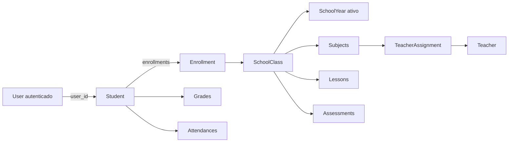

# Portal do Aluno — funcionamento e regras atuais

> Documento funcional e técnico baseado no código-fonte em 23 de agosto de 2026.
> Esta página descreve o que está implementado hoje, as regras observadas e as inconsistências conhecidas. Propostas de evolução são mantidas no backlog local `.dev-tasks/student-module`.

## 1. Objetivo do módulo

O Portal do Aluno oferece ao estudante autenticado uma visão somente de leitura de sua vida acadêmica no ano letivo ativo. O módulo reúne:

- painel resumido;
- notas e boletim;
- frequência;
- disciplinas;
- detalhes de cada disciplina;
- calendário acadêmico.

O portal não possui cadastro acadêmico próprio. Usuário, aluno, matrícula, turma, disciplinas, aulas, avaliações, notas e frequências são preparados pelos módulos administrativos e pelo portal do professor.

## 2. Limites do módulo atual

O portal é servido pelo mesmo painel Filament usado pela administração e pelos professores. Não existe um `StudentPanelProvider` efetivamente registrado no bootstrap; a separação é feita por papel, permissão, visibilidade da navegação e autorização de cada página.

O aluno atualmente pode consultar dados e baixar o boletim. Não foram localizadas operações implementadas para:

- editar o próprio perfil;
- consultar documentos acadêmicos em página própria;
- consultar avaliações em página própria;
- justificar falta;
- enviar trabalhos;
- trocar mensagens com professores;
- selecionar outro ano letivo ou matrícula histórica;
- receber notificações de novas notas ou eventos.

As permissões `student.profile.view`, `student.documents.view` e `student.assessments.view` existem no catálogo, mas não correspondem a páginas próprias completas. Há widgets que consultam permissões de perfil e avaliações, porém o dashboard customizado exibe suas avaliações próximas sem verificar `student.assessments.view` separadamente.

## 3. Arquitetura e fluxo de dados



Fluxo comum executado pelas páginas:

1. obtém o usuário autenticado;
2. resolve `user.student` ou busca `Student` por `user_id`;
3. procura uma turma relacionada cujo ano letivo esteja ativo;
4. usa aluno e turma para filtrar notas, frequências, avaliações e aulas;
5. apresenta estado vazio quando aluno ou turma não são encontrados.

O contexto acadêmico não é centralizado em um serviço. Cada página repete sua própria consulta para encontrar aluno e turma atual.

## 4. Acesso e autorização

### 4.1 Pré-condições gerais

Para acessar o portal, o usuário deve:

- estar autenticado;
- estar ativo;
- não estar bloqueado;
- possuir papel `student`;
- possuir a permissão exigida pela página ou receber o fallback legado do papel;
- possuir um `Student` vinculado para visualizar dados;
- possuir uma turma ligada a um ano letivo ativo para visualizar contexto acadêmico.

Usuário ativo e desbloqueado é uma condição de acesso ao painel inteiro. As páginas do aluno usam `PermissionAccess::can()`. Permissões com prefixo `student.` exigem também o papel `student`, mesmo se outro papel possuir a permissão.

### 4.2 Permissões catalogadas

| Permissão | Uso atual |
|---|---|
| `student.dashboard.view` | Acessar o painel do aluno |
| `student.grades.view` | Consultar notas |
| `student.attendance.view` | Consultar frequência |
| `student.subjects.view` | Consultar disciplinas e detalhes |
| `student.calendar.view` | Consultar calendário |
| `student.assessments.view` | Usada por widget; o dashboard customizado não a verifica separadamente |
| `student.profile.view` | Catálogo/widget; não há página própria completa |
| `student.documents.view` | Catalogada; não há página própria implementada |
| `student.report-card.download` | Exibir e executar download do boletim |

### 4.3 Comportamento da matriz

Se o papel possui alguma permissão explícita do módulo “Portal do Aluno”, a ausência de outra permissão do mesmo módulo passa a negar o acesso. Se o papel ainda não utiliza a matriz, existe fallback legado que libera as permissões de aluno para o papel `student`.

Isso permite migração gradual, mas faz o comportamento depender de o papel já ter ou não permissões explícitas do módulo.

## 5. Entrada e rotas

Após autenticar, o acesso à raiz `/lumina` é redirecionado pelo papel `student` para `/lumina/dashboard-student`.

| Método | URI | Nome Filament | Página | Permissão |
|---|---|---|---|---|
| GET | `/lumina` | `filament.lumina.home` | Entrada do painel | Usuário de painel |
| GET | `/lumina/login` | `filament.lumina.auth.login` | Login | Pública |
| POST | `/lumina/logout` | `filament.lumina.auth.logout` | Logout | Autenticado |
| GET | `/lumina/dashboard-student` | `filament.lumina.pages.dashboard-student` | Painel do aluno | `student.dashboard.view` |
| GET | `/lumina/my-grades` | `filament.lumina.pages.my-grades` | Minhas notas | `student.grades.view` |
| GET | `/lumina/student-attendance` | `filament.lumina.pages.student-attendance` | Frequência | `student.attendance.view` |
| GET | `/lumina/my-subjects` | `filament.lumina.pages.my-subjects` | Minhas disciplinas | `student.subjects.view` |
| GET | `/lumina/subject-detail?subject={id}` | `filament.lumina.pages.subject-detail` | Detalhe da disciplina | `student.subjects.view` |
| GET | `/lumina/academic-calendar` | `filament.lumina.pages.academic-calendar` | Calendário | `student.calendar.view` |

`subject-detail` recebe o identificador por query string, não por segmento de rota. A página valida se a disciplina pertence a alguma turma do aluno no ano letivo ativo antes de liberar o conteúdo.

## 6. Navegação atual

| Ordem | Item | Ícone | Condição |
|---:|---|---|---|
| 0 | Painel do Aluno | Graduação | `student.dashboard.view` |
| 1 | Minhas Notas | Gráfico | `student.grades.view` |
| 2 | Frequência | Calendário | `student.attendance.view` |
| 3 | Minhas Disciplinas | Livro | `student.subjects.view` |
| 4 | Calendário | Calendário | `student.calendar.view` |

O detalhe da disciplina não aparece no menu e é alcançado a partir de “Minhas Disciplinas”.

## 7. Fluxo funcional por página

### 7.1 Painel do Aluno

**Rota:** `/lumina/dashboard-student`

**Classe:** `App\Filament\Pages\DashboardStudent`

O dashboard resolve o aluno e seleciona a primeira turma encontrada em um ano letivo com `is_active = true`. Os dados são armazenados em cache por cinco minutos usando somente o ID do aluno como chave.

Conteúdo atual:

- identificação do aluno, turma, série e ano;
- frequência geral;
- média geral simples por disciplina;
- quantidade de disciplinas aprovadas, em recuperação ou reprovadas;
- aulas do dia;
- avaliações dos próximos sete dias;
- seis notas mais recentes;
- atalhos condicionados às permissões de notas, frequência, disciplinas e calendário.

Para o resumo de notas, recuperações são excluídas e é calculada a média simples das notas por disciplina. Os limites usados são:

- média maior ou igual a 6: aprovado;
- média entre 4 e menor que 6: recuperação;
- média menor que 4: reprovado.

### 7.2 Minhas Notas

**Rota:** `/lumina/my-grades`

**Classe:** `App\Filament\Pages\Student\MyGrades`

A página localiza a turma do ano ativo e consulta todas as notas do aluno nessa turma. O aluno pode alternar entre ano completo e `b1`, `b2`, `b3`, `b4`.

As notas são agrupadas por disciplina e processadas por `GradeCalculationService`:

- notas sem `score` não entram na média;
- a média do bimestre é ponderada por `weight`, assumindo peso 1 quando ausente;
- recuperação não entra na média regular;
- havendo recuperação, a média final do período usa o maior valor entre média regular e nota de recuperação;
- a média geral da disciplina é a média simples das médias finais dos períodos disponíveis;
- média geral maior ou igual a 6 é `approved`;
- média geral entre 4 e menor que 6 é `recovery`;
- média geral menor que 4 é `failed`;
- sem média calculável é `ongoing`;
- o serviço estima pontos necessários em uma futura avaliação de peso 1, limitado a 10.

A página ordena disciplinas na sequência: reprovada, recuperação, em andamento e aprovada.

#### Boletim em PDF

O botão “Baixar Boletim (PDF)” aparece com `student.report-card.download`. O PDF é gerado dentro da própria página usando os dados já filtrados pelo aluno autenticado e pela turma atual.

Quando um período foi selecionado na tela, o PDF usa o mesmo conjunto filtrado. Sem aluno ou turma, o método encerra sem download e sem mensagem específica.

### 7.3 Frequência

**Rota:** `/lumina/student-attendance`

**Classe:** `App\Filament\Pages\Student\StudentAttendance`

A página permite filtrar por ano completo ou pelos quatro bimestres. Apresenta:

- total de registros;
- presenças;
- faltas;
- atrasos;
- faltas justificadas;
- percentual geral;
- alerta abaixo de 75%;
- limite estimado e faltas restantes;
- resumo por disciplina;
- calendário visual dos dois últimos meses;
- tabela paginada com data, disciplina, horário, status, observação e tópico da aula;
- filtros adicionais por status e disciplina.

Na página, presença, atraso e falta justificada entram no numerador do percentual geral. A fórmula é:

```text
(presenças + atrasos + faltas justificadas) / total × 100
```

O alerta só aparece quando há registros e o percentual é inferior a 75%.

Os períodos usados por essa página são datas fixas do ano civil atual:

| Período | Intervalo atual |
|---|---|
| b1 | 1º de janeiro a 31 de março |
| b2 | 1º de abril a 30 de junho |
| b3 | 1º de julho a 30 de setembro |
| b4 | 1º de outubro a 31 de dezembro |

### 7.4 Minhas Disciplinas

**Rota:** `/lumina/my-subjects`

**Classe:** `App\Filament\Pages\Student\MySubjects`

A fonte de disciplinas é a relação `class_subjects` da turma escolhida. Para cada disciplina, a página agrega:

- nome, código, categoria e descrição;
- professor encontrado em `TeacherAssignment`;
- carga horária semanal da matriz série-disciplina;
- médias simples por bimestre;
- média simples geral de todas as notas;
- presenças, faltas e percentual de frequência;
- link para detalhes.

Nessa página, o percentual considera apenas status `present` no numerador. Atrasos e faltas justificadas não são considerados presença. As médias também são simples, incluem as notas recuperativas e não usam `GradeCalculationService`.

### 7.5 Detalhe da Disciplina

**Rota:** `/lumina/subject-detail?subject={id}`

**Classe:** `App\Filament\Pages\Student\SubjectDetail`

No `mount`, a página exige o parâmetro `subject`, resolve o aluno e verifica se a disciplina pertence a uma turma do ano ativo vinculada ao estudante.

Conteúdo:

- informações da disciplina;
- professor da alocação;
- carga horária semanal;
- ementa e objetivos da matriz curricular;
- notas e médias por bimestre;
- média geral;
- frequência da disciplina;
- aulas, conteúdo e situação de frequência do aluno;
- estatísticas mensais.

As médias são simples e incluem todas as notas. A frequência considera presença mais atraso, mas não falta justificada. As estatísticas mensais são agrupadas por `created_at` da frequência, não pela data acadêmica do registro.

Para cada aula, é executada uma consulta adicional para localizar a frequência do aluno naquela aula.

### 7.6 Calendário Acadêmico

**Rota:** `/lumina/academic-calendar`

**Classe:** `App\Filament\Pages\Student\AcademicCalendar`

Modos disponíveis:

- mês;
- semana;
- lista.

Filtros disponíveis:

- avaliações;
- feriados;
- recessos;
- eventos escolares;
- períodos letivos;
- disciplina.

Fontes dos eventos:

- `Assessment`, limitado à turma atual;
- `SchoolHoliday`, limitado ao ano letivo;
- início e fim do ano letivo;
- limites de bimestre calculados pelo sistema.

O calendário mostra próximos eventos em uma janela de 14 dias. O nome do professor é obtido da alocação turma-disciplina.

Os botões de exportação PDF e iCal estão visíveis, mas seus métodos são stubs: apenas disparam uma mensagem informando que a exportação estará disponível futuramente.

Os limites dos quatro bimestres não usam `SchoolYearTerm`. O intervalo entre início e fim do ano é dividido matematicamente em quatro partes iguais.

## 8. Regras de negócio identificadas

### RN-ALU-001 — Identidade do portal

Dados pessoais do portal são sempre resolvidos pelo `Student` associado ao `User` autenticado. O usuário não informa um ID de aluno para as páginas principais.

### RN-ALU-002 — Papel obrigatório

Permissões `student.*` só são válidas para um usuário com papel `student`.

### RN-ALU-003 — Contexto do ano ativo

As páginas acadêmicas usam uma turma cujo ano letivo possui `is_active = true`.

### RN-ALU-004 — Ausência de contexto

Sem `Student` ou turma do ano ativo, as páginas retornam coleções e estatísticas vazias em vez de consultar dados globais.

### RN-ALU-005 — Isolamento de dados

Notas e frequências são filtradas simultaneamente por `student_id` autenticado e `class_id` da turma atual. O detalhe da disciplina ainda valida que a disciplina pertence à turma do aluno.

### RN-ALU-006 — Média oficial no serviço

O cálculo mais completo existente é o `GradeCalculationService`: média ponderada, exclusão de notas nulas, tratamento de recuperação e classificação com limites 6 e 4.

### RN-ALU-007 — Recuperação

A recuperação pode se relacionar à nota original por `recovery_of_id`; sem esse vínculo, é associada pelo mesmo bimestre. O melhor resultado entre média regular e recuperação é usado como média final do período.

### RN-ALU-008 — Frequência mínima

O portal usa 75% como frequência mínima e sinaliza risco abaixo desse valor quando existem registros.

### RN-ALU-009 — Situações de frequência

Os estados disponíveis são presente, ausente, atrasado e falta justificada.

### RN-ALU-010 — Boletim condicionado

O download do boletim exige `student.report-card.download`, além do acesso à página de notas.

### RN-ALU-011 — Calendário contextual

Avaliações são filtradas pela turma; feriados são filtrados pelo ano letivo; o filtro por disciplina atua sobre avaliações.

### RN-ALU-012 — Cache do dashboard

O dashboard mantém seus dados por cinco minutos por ID de aluno.

## 9. Requisitos funcionais observados

| Código | Requisito atual | Situação |
|---|---|---|
| RF-ALU-001 | Autenticar o aluno no painel | Implementado |
| RF-ALU-002 | Direcionar aluno ao seu dashboard | Implementado |
| RF-ALU-003 | Restringir páginas por papel e permissão | Implementado |
| RF-ALU-004 | Exibir contexto da turma no ano ativo | Implementado com limitações |
| RF-ALU-005 | Exibir resumo de notas, frequência, aulas e avaliações | Implementado |
| RF-ALU-006 | Consultar notas por período e disciplina | Implementado |
| RF-ALU-007 | Calcular média ponderada e recuperação na página de notas | Implementado |
| RF-ALU-008 | Baixar boletim em PDF | Implementado |
| RF-ALU-009 | Consultar frequência geral e por disciplina | Implementado |
| RF-ALU-010 | Filtrar frequência por período, status e disciplina | Implementado |
| RF-ALU-011 | Consultar disciplinas da turma | Implementado |
| RF-ALU-012 | Consultar detalhes de uma disciplina autorizada | Implementado |
| RF-ALU-013 | Consultar calendário em mês, semana e lista | Implementado |
| RF-ALU-014 | Filtrar calendário por categoria e disciplina | Implementado |
| RF-ALU-015 | Exportar calendário PDF/iCal | Apenas interface; não implementado |
| RF-ALU-016 | Consultar perfil em página própria | Não implementado |
| RF-ALU-017 | Consultar documentos em página própria | Não implementado |
| RF-ALU-018 | Consultar avaliações em página própria | Não implementado |
| RF-ALU-019 | Selecionar histórico por ano/matrícula | Não implementado |
| RF-ALU-020 | Receber notificações acadêmicas | Não implementado |

## 10. Requisitos não funcionais observados

### RNF-ALU-001 — Segurança de acesso

Todas as páginas devem exigir autenticação, papel `student` e permissão específica. O acesso por URL deve seguir a mesma regra da navegação.

### RNF-ALU-002 — Privacidade

Consultas devem ser derivadas do usuário autenticado e nunca aceitar livremente `student_id` vindo da interface.

### RNF-ALU-003 — Desempenho

O dashboard utiliza cache de cinco minutos. As demais páginas executam consultas sob demanda, com eager loading parcial.

### RNF-ALU-004 — Responsividade

As views possuem regras responsivas próprias e utilizam componentes Filament, estilos inline e blocos CSS locais. Não existe, no código analisado, uma suíte automatizada que valide responsividade.

### RNF-ALU-005 — Acessibilidade

As telas usam rótulos, cores e ícones, mas não foi encontrada auditoria automatizada de contraste, navegação por teclado, leitor de tela ou foco.

### RNF-ALU-006 — Localização

Textos, datas e labels são apresentados em português. Partes do código usam `pt_BR` para nomes de meses.

### RNF-ALU-007 — Disponibilidade degradada

Na ausência de aluno ou turma, o módulo retorna estados vazios. Algumas telas não diferenciam claramente cadastro incompleto, ausência de matrícula e indisponibilidade de dados.

### RNF-ALU-008 — Consistência

O mesmo indicador acadêmico deveria produzir o mesmo valor em todas as páginas. Este requisito não é atendido integralmente no estado atual.

### RNF-ALU-009 — Testabilidade

Não foram localizados testes funcionais específicos para dashboard, notas, frequência, disciplinas, calendário ou isolamento entre dois alunos.

### RNF-ALU-010 — Auditabilidade

O download do boletim ocorre dentro da página e não registra explicitamente histórico de downloads.

## 11. Inconsistências e limitações conhecidas

### 11.1 Seleção de matrícula/turma sem status

Todas as páginas procuram a primeira turma ligada a um ano ativo, mas a relação `Student::classes()` não filtra status da matrícula. Matrículas canceladas, concluídas, transferidas ou trancadas podem participar da seleção. Se houver mais de uma turma no ano, `first()` escolhe uma sem ordenação de negócio.

### 11.2 Notas não publicadas podem ser exibidas

O professor usa `Grade.locked_at` como indicação de publicação, e períodos possuem `grades_published`. As consultas do aluno não filtram nenhum desses campos. Assim, uma nota salva como rascunho pode aparecer no portal.

### 11.3 Fórmulas de nota divergentes

| Tela | Fórmula atual |
|---|---|
| Dashboard | Média simples por disciplina; exclui recuperação |
| Minhas Notas | Média ponderada; recuperação pelo melhor resultado |
| Minhas Disciplinas | Média simples; inclui recuperação |
| Detalhe da Disciplina | Média simples; inclui recuperação |

Além disso, a view de disciplinas usa faixas visuais próximas de 7 e 5, enquanto o serviço oficial classifica aprovação em 6 e recuperação em 4.

### 11.4 Fórmulas de frequência divergentes

| Local | Conta como presença |
|---|---|
| `Attendance::calculateFrequency` e dashboard | Presente + atraso |
| Página Frequência | Presente + atraso + falta justificada |
| Minhas Disciplinas | Somente presente |
| Detalhe da Disciplina | Presente + atraso |

O enum `AttendanceStatus::countsAsPresent()` considera presente e atraso, não falta justificada.

### 11.5 Períodos ignoram configuração acadêmica

A página Frequência divide o ano civil em quatro trimestres fixos. O Calendário divide matematicamente o ano letivo em quatro partes. Nenhuma das duas usa as datas cadastradas em `SchoolYearTerm`, embora esse modelo exista.

### 11.6 Ano exibido pode não ser o ano letivo

Labels de notas e frequência usam `now()->year`, enquanto os dados acadêmicos vêm da turma do ano ativo. Em implantação antecipada, histórico ou ano letivo fora do ano civil, o rótulo pode divergir.

### 11.7 Dashboard pode permanecer desatualizado

A chave de cache usa somente o ID do aluno e não há invalidação localizada quando professor publica nota, lança frequência, altera avaliação ou ocorre mudança de turma. O dado pode ficar desatualizado por até cinco minutos e a mesma chave não distingue ano/matrícula.

### 11.8 Detalhe de disciplina executa consultas repetidas

Para cada aula, a página consulta individualmente a frequência do aluno, produzindo padrão N+1. Também agrupa estatísticas mensais por data de criação do registro, em vez da data da aula/frequência.

### 11.9 Disciplinas usam fontes diferentes

“Minhas Disciplinas” usa `class_subjects`. O filtro do calendário usa disciplinas presentes em `teacher_assignments`. Uma disciplina curricular ainda sem professor pode aparecer em uma tela e não no filtro da outra.

### 11.10 Exportações do calendário não existem

Botões PDF e iCal são apresentados como ações, mas apenas exibem mensagem de funcionalidade futura.

### 11.11 URLs estão escritas diretamente nas views

Atalhos usam caminhos como `/lumina/my-grades` em vez dos nomes de rota do Filament. Mudança de slug ou path pode quebrar links silenciosamente.

### 11.12 Estados vazios pouco específicos

Em várias páginas, ausência de vínculo de aluno, matrícula ativa, turma ou dados resulta no mesmo estado vazio. O aluno não recebe orientação precisa sobre qual situação deve ser resolvida pela secretaria.

### 11.13 Permissões sem funcionalidades equivalentes

Perfil, documentos e avaliações possuem permissões catalogadas, mas não há páginas completas correspondentes. Além disso, o dashboard exibe avaliações próximas sem condicionar esse bloco a `student.assessments.view`. Isso pode causar expectativa incorreta na matriz administrativa.

### 11.14 Cobertura de testes insuficiente

Há teste para negar permissão estudantil a um usuário sem papel de aluno, mas não há testes específicos das páginas, fórmulas, publicação de notas, contexto de matrícula e isolamento de dados.

### 11.15 Relacionamento suspeito no modelo Student

`Student::students()` declara uma relação do aluno com outros alunos usando `class_id` como chave na tabela de matrículas. A relação aparenta estar obsoleta ou incorreta e não faz parte do fluxo legítimo do portal.

## 12. Dados necessários para funcionamento

Para que um aluno visualize o portal completo, a base deve possuir:

1. `User` ativo e desbloqueado;
2. papel `student` e permissões do portal;
3. `Student.user_id` apontando para o usuário;
4. matrícula ligando aluno e turma;
5. turma ligada ao ano letivo ativo;
6. disciplinas associadas à turma;
7. alocações docentes para exibir professor;
8. aulas e frequências para os indicadores de presença;
9. avaliações e notas para desempenho e boletim;
10. feriados e períodos para enriquecer o calendário.

## 13. Arquivos principais

| Responsabilidade | Arquivo |
|---|---|
| Painel | `app/Filament/Pages/DashboardStudent.php` |
| Notas | `app/Filament/Pages/Student/MyGrades.php` |
| Frequência | `app/Filament/Pages/Student/StudentAttendance.php` |
| Disciplinas | `app/Filament/Pages/Student/MySubjects.php` |
| Detalhe | `app/Filament/Pages/Student/SubjectDetail.php` |
| Calendário | `app/Filament/Pages/Student/AcademicCalendar.php` |
| Cálculo de notas | `app/Services/GradeCalculationService.php` |
| Acesso | `app/Support/PermissionAccess.php` |
| Redirecionamento | `app/Http/Middleware/RedirectUserByRole.php` |
| Catálogo de permissões | `config/lumina-permissions.php` |
| Views | `resources/views/filament/pages/student` |
| Dashboard Blade | `resources/views/filament/pages/dashboard-student.blade.php` |
| Boletim | `resources/views/pdf/report-card.blade.php` |

## 14. Referência de manutenção

Ao modificar o portal, deve-se conferir no mínimo:

- papel e permissão da página;
- vínculo entre usuário e aluno;
- matrícula e status aceitos;
- ano letivo e período configurado;
- isolamento por `student_id`, turma e disciplina;
- regra única de média e frequência;
- publicação da informação antes de exibi-la;
- estados sem dados;
- cache e invalidação;
- testes com dois alunos distintos.

As tarefas de correção e melhoria derivadas desta análise ficam no backlog local `.dev-tasks/student-module/README.md` e não fazem parte da documentação versionada do comportamento atual.
