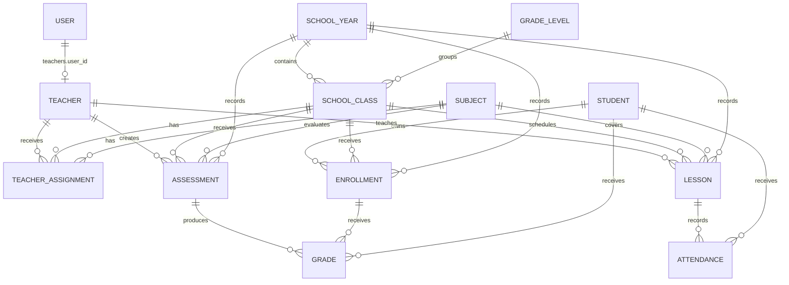
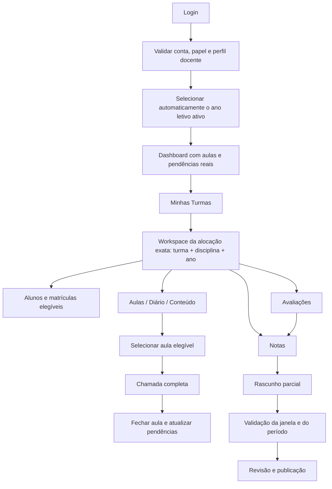

# Portal do Professor

> Auditoria funcional e técnica do comportamento existente em 23/08/2026. Este documento descreve o código atual; propostas futuras estão explicitamente separadas. Nenhuma regra de produção foi alterada nesta etapa.

## Resumo executivo

O Portal do Professor é implementado no mesmo painel Filament (`/lumina`) usado pelos demais perfis. O usuário entra pelo login do Filament, precisa estar ativo e desbloqueado, possuir o papel `teacher` e ter um registro em `teachers` ligado por `teachers.user_id`. As turmas e disciplinas disponíveis derivam de `teacher_assignments`, cuja combinação `class_id + subject_id` identifica a alocação docente e cujo ano letivo é obtido indiretamente por `classes.school_year_id`.

O módulo entrega hoje dashboard, cartões de turmas, agenda semanal, cadastro e fechamento de avaliações, lançamento/publicação de notas, lançamento binário de frequência e edição de dados básicos do perfil. Não há no fluxo ativo uma página de alunos da turma, criação/edição de aulas, diário de classe, registro de conteúdo ministrado, comunicados ou uma página própria de pendências.

Os controles mais sólidos estão nos fluxos principais de notas e frequência, que revalidam no servidor a combinação exata professor–turma–disciplina. Entretanto, foram encontrados dois riscos críticos de integridade: o `upsert` de notas pode reaproveitar e mover uma nota entre avaliações diferentes, e o portal grava frequência sem `lesson_id` apesar de a unicidade vigente ser `(student_id, lesson_id)`. Também há escopos inseguros no dashboard/agenda, inconsistências de período letivo, falhas de autorização granular e ausência quase total de testes do módulo.

### Resultado quantitativo

| Indicador | Total |
|---|---:|
| Arquivos diretamente mapeados pela busca temática | 87 |
| Regras de negócio identificadas | 31 |
| Inconsistências catalogadas | 25 |
| Problemas `CRITICAL` | 2 |
| Problemas com categoria `SECURITY` ou `AUTHORIZATION` | 6 |
| Melhorias práticas de UX | 10 |
| Tasks técnicas criadas | 19 |

## 1. Visão geral

O propósito observado do módulo é oferecer ao professor uma área pessoal para consultar sua alocação acadêmica e operar avaliações, notas e frequência sem acesso aos cadastros administrativos globais.

O painel é compartilhado, mas a navegação é segmentada por `canAccess()`/`shouldRegisterNavigation()`. Recursos administrativos usam `BaseAdminResource` e permissões próprias, enquanto as páginas docentes usam `HasTeacherPortalAccess` e permissões `teacher.*`.

### O que existe

- Dashboard pessoal com turmas, disciplinas, aulas, avaliações e pendências calculadas.
- “Minhas Turmas” em cartões por alocação turma–disciplina.
- Agenda semanal somente leitura, de segunda a sexta, com filtros e detalhes pedagógicos.
- Avaliações: listar, filtrar, criar, editar e fechar.
- Notas: grade por avaliação, rascunho e publicação com bloqueio posterior.
- Frequência: chamada por turma, disciplina e data com estado presente/ausente.
- Perfil: consulta de dados e edição de e-mail pessoal, telefones e avatar.

### O que não existe no fluxo ativo

- Página/listagem navegável de alunos da turma.
- Cadastro ou edição de aula pelo professor.
- Diário de classe e registro de conteúdo efetivamente ministrado.
- Registro completo de atraso e falta justificada no formulário atual.
- Comunicados e página de pendências, apesar das permissões e cartões existentes.
- Página “Minhas Disciplinas”, apesar da permissão `teacher.subjects.view`.

## 2. Arquitetura atual

### Camadas e componentes

| Camada | Elementos principais | Responsabilidade atual |
|---|---|---|
| Painel/autenticação | `AdminPanelProvider`, `User::canAccessPanel()`, `EnsureUserIsActive`, `RedirectUserByRole` | Login, sessão, bloqueio de usuário e redirecionamento por papel |
| Autorização de página | `HasTeacherPortalAccess`, `PermissionAccess` | Exibição da navegação e acesso direto às páginas `teacher.*` |
| Contexto docente | `CurrentTeacherService` | Resolve `User -> Teacher` e carrega todas as alocações do professor |
| Páginas Filament/Livewire | `DashboardTeacher`, `MyClasses`, `TeacherSchedule`, `TeacherAssessments`, `TeacherGrades`, `TeacherAttendance`, `TeacherProfile` | Fluxo de interface e, em muitos casos, regras e persistência |
| Domínio Eloquent | `Teacher`, `TeacherAssignment`, `SchoolClass`, `Subject`, `SchoolYear`, `SchoolYearTerm`, `Enrollment`, `Student`, `Assessment`, `Grade`, `Lesson`, `Attendance` | Relacionamentos e parte das regras |
| Autorização por model | `GradePolicy` | Autoriza visualização/edição de nota por `teacher_id`; não é usada explicitamente pelas páginas docentes |
| Banco | migrations das tabelas acadêmicas | FKs, índices, unicidade e estados persistidos |
| Interface | sete templates Blade do professor | Cards, tabelas/grades, filtros, mensagens e responsividade |
| Código legado | quatro widgets docentes e `teacher-schedule.blade.php` | Não foi encontrada inclusão no dashboard docente ativo; contém fluxo alternativo de frequência |

Não foram encontrados controllers, Form Requests, DTOs, repositories ou actions específicos do Portal do Professor. As mutações estão concentradas nas páginas Livewire/Filament.

### Arquivos centrais

- `app/Services/CurrentTeacherService.php`
- `app/Support/PermissionAccess.php`
- `app/Filament/Pages/Teacher/*`
- `resources/views/filament/pages/teacher/*`
- `app/Models/{Teacher,TeacherAssignment,SchoolClass,Subject,SchoolYear,SchoolYearTerm,Enrollment,Student,Assessment,Grade,Lesson,Attendance}.php`
- `config/lumina-permissions.php`
- `database/migrations/*teachers*`, `*teacher_assignments*`, `*classes*`, `*enrollments*`, `*assessments*`, `*grades*`, `*lessons*`, `*attendances*`

## 3. Modelo de dados



### Relações e constraints observadas

| Estrutura | Regra persistida |
|---|---|
| `teachers.user_id` | Nullable, FK com `nullOnDelete`; não há `unique` explícito na migration inicial |
| `teacher_assignments` | FKs obrigatórias; `unique(class_id, subject_id)` permite apenas um professor por disciplina/turma |
| `classes` | Ano e nível são nullable; unicidade por `school_year_id, grade_level_id, name, shift`; soft delete |
| `class_subjects` | `unique(class_id, subject_id)`; sincronizada por eventos de `TeacherAssignment` |
| `enrollments` | `unique(student_id, class_id)` e `registration_number` único; ano nullable; soft delete |
| `assessments` | Professor e ano nullable; turma/disciplinas com cascade; sem constraint que prove a alocação docente |
| `grades` | Nota obrigatória; `assessment_id` e `enrollment_id` nullable; duas unicidades coexistem: a operacional antiga e `(assessment_id, student_id)` |
| `lessons` | Professor/turma/disciplina obrigatórios; ano nullable; soft delete; sem unicidade de horário |
| `attendances` | `lesson_id` nullable; unicidade `(student_id, lesson_id)`; status é string sem check constraint |
| `school_year_terms` | Sequência única por ano; datas e janela de notas; suporta bimestre, trimestre, semestre e anual |

### Dependência do histórico

O histórico não é inteiramente autônomo. Notas, avaliações, aulas e frequências ainda dependem de relações mutáveis (`classes.school_year_id`, matrícula atual e alocações atuais). A remoção de uma alocação não apaga diretamente notas/avaliações, mas retira o acesso do professor. `forceDelete` de turma, disciplina, professor ou aluno pode acionar cascatas em registros acadêmicos. Essa política precisa ser formalizada antes de migrations corretivas.

## 4. Fluxo atual do professor

```mermaid
flowchart TD
    A[Login Filament em /lumina/login] --> B{Usuário ativo e desbloqueado?}
    B -- não --> C[Logout e erro de conta]
    B -- sim --> D{Papel principal no redirecionamento}
    D -- teacher --> E[/lumina/dashboard-teacher]
    E --> F{Permissão teacher.dashboard.view}
    F -- negada --> G[403 / página indisponível]
    F -- concedida --> H{Existe User -> Teacher?}
    H -- não --> I[Estado vazio; notas/frequência podem falhar por chaves ausentes]
    H -- sim --> J[Carrega teacher_assignments]
    J --> K[Dashboard]
    J --> L[Minhas Turmas]
    J --> M[Agenda semanal]
    J --> N[Avaliações]
    J --> O[Lançar Notas]
    J --> P[Lançar Frequência]
    J --> Q[Meu Perfil]
    N --> O
    P --> R[Turma + disciplina + data + alunos atuais]
    O --> S[Turma + disciplina + avaliação + alunos atuais]
```

### Rotas reais

| Método | Rota | Classe | Permissão de página |
|---|---|---|---|
| GET | `/lumina/dashboard-teacher` | `DashboardTeacher` | `teacher.dashboard.view` |
| GET | `/lumina/teacher-my-classes` | `MyClasses` | `teacher.classes.view` |
| GET | `/lumina/teacher-schedule` | `TeacherSchedule` | `teacher.schedule.view` |
| GET | `/lumina/teacher-assessments` | `TeacherAssessments` | `teacher.assessments.view` |
| GET | `/lumina/teacher-grades` | `TeacherGrades` | `teacher.grades.view` |
| GET | `/lumina/teacher-attendance` | `TeacherAttendance` | `teacher.attendance.view` |
| GET | `/lumina/teacher-profile` | `TeacherProfile` | `teacher.profile.view` |

Todas passam pelos middlewares do painel, incluindo autenticação, sessão, CSRF, `EnsureUserIsActive` e `RedirectUserByRole`. As ações Livewire usam os mesmos endpoints internos do Filament/Livewire, não controllers próprios.

### Fluxos alternativos

- Usuário com múltiplos papéis: o redirecionamento da raiz prioriza `admin`, depois `teacher`, depois `student`. Um usuário `admin + teacher` vai ao dashboard administrativo, mas pode acessar diretamente o portal docente porque satisfaz o papel `teacher`.
- Matriz vazia: se o papel do professor não tiver nenhuma permissão explícita do módulo, `PermissionAccess::legacyRoleFallback()` volta a conceder todas as permissões docentes conhecidas.
- Widgets docentes antigos: existem `TeacherAttendanceWidget`, `TeacherStats`, `RecentAttendanceTeacher` e `MyClassesTable`, mas não foi encontrada inclusão nas páginas docentes atuais. Devem ser considerados código dormente, não parte confirmada do fluxo ativo.

## 5. Funcionalidades existentes

### 5.1 Dashboard

Finalidade: oferecer resumo e próximas atividades.

Fluxo atual: resolve o professor, carrega alocações, produz listas independentes de IDs de turmas e disciplinas, busca aulas da semana, avaliações futuras, notas/frequências pendentes e registros recentes.

Arquivos: `DashboardTeacher.php` e `dashboard-teacher.blade.php`.

Limitações:

- A combinação independente de IDs gera produto cartesiano implícito e pode incluir dados de outra alocação.
- Não filtra ano letivo ou status da turma/alocação.
- “Notas pendentes” procura `grades.score IS NULL`, mas `score` nasceu obrigatório no banco e o fluxo não cria linhas vazias.
- Frequência salva pela página não marca `lessons.attendance_taken`, portanto a pendência continua.
- Comunicados é sempre zero e não existe fluxo correspondente.

### 5.2 Minhas Turmas

Finalidade: listar as alocações do professor em cartões.

Fluxo atual: uma entrada por `TeacherAssignment`, exibindo turma, disciplina, nível, turno, ano, alunos e carga horária semanal.

Arquivos: `MyClasses.php` e `my-classes.blade.php`.

Limitações:

- Os quatro CTAs (“Ver alunos”, frequência, notas e avaliação) usam `href="#"`; não navegam nem preservam contexto.
- O ano usa `schoolYear.name`, atributo inexistente; o model expõe `year`.
- A contagem usa a relação geral de alunos, sem filtrar status de matrícula.
- Há duas consultas adicionais por alocação (alunos e carga horária).

### 5.3 Agenda de aulas

Finalidade: consultar aulas por semana e seus detalhes pedagógicos.

Fluxo atual: semana de segunda a sexta, navegação anterior/atual/próxima, filtros por ano/turma/disciplina/turno e modal de detalhes com conteúdo, ementa e objetivos.

Arquivos: `TeacherSchedule.php` e `teacher-schedule-weekly.blade.php`.

Limitações:

- Escopo alternativo por listas independentes pode mostrar aula fora da alocação exata.
- Filtro e detalhe exibem `schoolYear.name`, que não existe.
- Professor desligado não é marcado como afastado nessa tela, enquanto outras mutações o bloqueiam.
- Não há criação, edição, conclusão de aula ou registro de conteúdo ministrado.
- O template antigo `teacher-schedule.blade.php` não é utilizado.

### 5.4 Avaliações

Finalidade: gerir avaliações do próprio professor.

Fluxo atual: tabela paginada com filtros; criação e edição por modal; fechamento confirmado. A query principal usa `Assessment::forTeacher()`. No save, o servidor substitui `teacher_id`, deriva o ano da turma e valida a alocação exata.

Arquivos: `TeacherAssessments.php`, `teacher-assessments.blade.php`, `Assessment.php`.

Regras aplicadas:

- Professor precisa possuir a combinação turma–disciplina.
- Ano encerrado bloqueia criação/edição.
- Nota máxima e peso devem ser positivos.
- Avaliação fechada não pode ser editada.
- Fechamento exige `teacher.assessments.close` e propriedade por `teacher_id`.

Limitações:

- `create/update` dependem da visibilidade da Action; o handler não repete a permissão correspondente.
- Professor afastado/inativo/desligado não cria, mas ainda pode editar/fechar registros existentes.
- O fechamento não verifica ano encerrado nem situação das notas.
- A disciplina do formulário não depende visualmente da turma; erro surge apenas ao enviar.
- Data pode ficar fora do ano/período e os tipos em português divergem do enum usado em `grades`.
- As estatísticas carregam todas as avaliações e a tabela executa outra consulta.

### 5.5 Notas

Finalidade: lançar notas em grade por avaliação e publicá-las.

Fluxo atual: seleciona automaticamente a primeira alocação e primeira avaliação; permite trocar turma, disciplina e avaliação; carrega matrículas atuais; exige nota para todos; salva em transação; publicar preenche `posted_by` e `locked_at`.

Arquivos: `TeacherGrades.php`, `teacher-grades.blade.php`, `Grade.php`, `GradePolicy.php`.

Regras aplicadas:

- Contexto exige alocação exata e avaliação do professor na mesma turma/disciplina.
- Professor bloqueado, avaliação fechada ou ano encerrado impedem mutação.
- Nota deve estar entre zero e `assessment.max_score`.
- Todas as linhas precisam de nota, inclusive no rascunho.
- Nota publicada (`locked_at`) é imutável pelo fluxo.
- Publicação exige permissão própria.

Limitações críticas:

- A busca do registro existente ignora `assessment_id` e usa `enrollment + subject + term + type + sequence`, com `sequence = 1`. Uma segunda avaliação do mesmo tipo/período pode atualizar a nota da primeira e trocar seu `assessment_id`.
- `create` e `update` são tratados com `OR`, permitindo a quem possui só uma das permissões executar ambos os comportamentos.
- O período é calculado pela janela aberta no dia do lançamento, não pela data da avaliação, e cai silenciosamente em `b1`.
- Não verifica `SchoolYearTerm::isGradeEntryOpen()` como bloqueio e só representa quatro bimestres.
- A tela sem professor/alocação retorna um payload incompleto e o Blade acessa chaves ausentes.

### 5.6 Frequência

Finalidade: registrar presença/falta em massa.

Fluxo atual: escolhe turma, disciplina e data; carrega matrículas atuais; marca todos como presentes por padrão; cada checkbox desligado vira falta; salva em transação com permissões separadas de criar/atualizar.

Arquivos: `TeacherAttendance.php`, `teacher-attendance.blade.php`, `Attendance.php`, `Lesson.php`.

Regras aplicadas:

- Contexto exige alocação exata do professor.
- Professor bloqueado e ano encerrado não alteram dados.
- Registro existente exige `teacher.attendance.update`; novo exige `teacher.attendance.create`.
- Matrículas ativas, suspensas e trancadas entram na chamada.

Limitações críticas:

- A página não seleciona nem grava `lesson_id`; a unicidade do banco é `(student_id, lesson_id)`, portanto valores `NULL` não protegem a chamada por turma/disciplina/data.
- Não chama `Lesson::markAttendanceTaken()`, mantendo a aula pendente e separando chamada do diário/aula documentados.
- Estados `late` e `excused` são apresentados como não presentes e sobrescritos para `absent` na próxima gravação.
- Aceita data futura, fim de semana, feriado, fora do ano e sem aula correspondente.
- `Attendance::canRecordForDate()` e `Lesson::canTakeAttendance()` não são usados; além disso, a fórmula atual não limita corretamente datas passadas.
- O resumo usa o status persistido, não o checkbox temporário.
- A tela sem professor/alocação também retorna payload incompleto para o Blade.

### 5.7 Perfil

Finalidade: consultar identidade funcional e editar contato/avatar.

Fluxo atual: mostra dados do professor, turmas e disciplinas; com `teacher.profile.update-basic`, atualiza e-mail pessoal, telefone, celular e avatar.

Limitações:

- Um novo avatar não remove o arquivo anterior.
- O fallback consulta `ui-avatars.com`, expondo o nome na URL e dependendo de terceiro.
- O e-mail de `Teacher` não atualiza o e-mail de login de `User`; salvar `User` futuramente pode sobrescrever o perfil docente. A intenção precisa de validação de negócio.

## 6. Regras de negócio existentes

| # | Regra | Implementação e tabelas | Validação/permissão | Comportamento/problema |
|---:|---|---|---|---|
| 1 | Conta precisa estar ativa e desbloqueada | `User::canAccessPanel`, `EnsureUserIsActive`; `users` | `active`, `locked_at` | Bloqueia o painel inteiro |
| 2 | Portal docente exige papel `teacher` | `PermissionAccess::requiredPortalRole` | Spatie Role | Admin sem papel docente não assume o portal |
| 3 | Cada página exige permissão `teacher.*` | Trait `HasTeacherPortalAccess` | `canAccess` e navegação | Protege acesso direto da página |
| 4 | Matriz explícita prevalece no módulo | `PermissionAccess::can` | permissões do papel | Se houver ao menos uma permissão do módulo, as demais negadas permanecem negadas |
| 5 | Papel legado recebe fallback completo | `legacyRoleFallback` | papel `teacher` | Remover todas as permissões reativa acesso total; provável erro de autorização |
| 6 | Usuário docente é ligado a um perfil | `User::teacher`, `CurrentTeacherService::current` | `teachers.user_id` | Sem perfil, o contexto fica vazio |
| 7 | Alocação define turma e disciplina | `teacher_assignments` | comparação exata em mutações principais | Fonte real de ownership acadêmico |
| 8 | Só um professor por turma/disciplina | índice `unique(class_id, subject_id)` | banco e parte das telas admin | Co-docência é impossível; `REQUIRES_BUSINESS_VALIDATION` |
| 9 | Alocação sincroniza disciplina da turma | eventos de `TeacherAssignment` | attach/detach em `class_subjects` | Remover último docente remove a disciplina da turma |
| 10 | Ano da alocação vem da turma | `TeacherAssignment -> SchoolClass -> SchoolYear` | indireta | Não há `school_year_id` na alocação |
| 11 | Serviço retorna todas as alocações | `CurrentTeacherService::assignments` | só `teacher_id` | Não filtra ano/status, misturando contexto atual e histórico |
| 12 | Professor bloqueado não cria avaliação | `teacherIsBlocked` em `TeacherAssessments` | status docente | Editar/fechar não aplica a mesma regra |
| 13 | Avaliação pertence ao criador | `assessments.teacher_id`, `forTeacher` | query/ações | Listagem e nota usam ownership direto |
| 14 | Avaliação exige alocação exata | `prepareAssessmentPayload` | turma + disciplina | Evita combinação adulterada no save |
| 15 | Ano encerrado bloqueia criar/editar avaliação | status da turma/ano | `SchoolYearStatus::CLOSED` | Fechamento não verifica essa regra |
| 16 | Avaliação fechada é imutável | `Assessment::isClosed()` | update | Não há reabertura no portal |
| 17 | Máximo e peso são positivos | form/payload | `minValue`, validação manual do máximo | Sem check constraint no banco |
| 18 | Nota exige avaliação própria e alocação exata | `TeacherGrades::resolveContext` | professor + turma + disciplina + avaliação | Resiste a IDs Livewire adulterados |
| 19 | Professor bloqueado não lança nota | `TeacherGrades::teacherIsBlocked` | status docente | Leitura continua disponível |
| 20 | Ano/avaliação fechados bloqueiam nota | `saveGrades` | status | Janela do período não é aplicada |
| 21 | Nota fica entre zero e máximo | loop de `saveGrades` | validação manual | Banco não possui check |
| 22 | Rascunho exige todos os alunos | `saveGrades` | score obrigatório por linha | “Rascunho” não admite preenchimento parcial |
| 23 | Publicação bloqueia nota | `locked_at`, `posted_by` | permissão publish | Sem fluxo de correção/reabertura |
| 24 | Período da nota é a janela de hoje | `resolveTerm`, `currentTerm` | fallback `b1` | Pode classificar avaliação histórica no período errado |
| 25 | Chamada exige alocação exata | `TeacherAttendance::resolveContext` | turma + disciplina | Resiste a IDs adulterados na página ativa |
| 26 | Professor bloqueado/ano encerrado bloqueiam chamada | `saveAttendance` | status docente/ano | Não valida data nem aula |
| 27 | Criar e corrigir frequência são permissões distintas | ramo create/update | `teacher.attendance.*` | Regra corretamente reavaliada no handler principal |
| 28 | Chamada atual é binária | checkbox | presente/ausente | Destrói atraso/justificativa existente |
| 29 | Matrículas ativas, suspensas e trancadas entram nas grades/chamadas | `whereIn(status)` | enum de matrícula | `REQUIRES_BUSINESS_VALIDATION` |
| 30 | Perfil básico exige permissão específica | `TeacherProfile::saveBasic` | `teacher.profile.update-basic` | Atualiza somente campos permitidos e avatar |
| 31 | Ano ativo é único em aplicação | `SchoolYear::booted` | update dos demais anos | Não há índice parcial/constraint que garanta isso fora do Eloquent |

## 7. Permissões e autorização

### Camadas existentes

1. Filament autentica o usuário.
2. `User::canAccessPanel()` nega conta inativa/bloqueada.
3. `EnsureUserIsActive` derruba sessão já aberta se o estado mudar.
4. `RedirectUserByRole` direciona somente a raiz do painel.
5. Cada página docente exige uma permissão via `PermissionAccess`.
6. Mutações de notas e frequência revalidam contexto e permissões no método de gravação.
7. Avaliações usam query por `teacher_id`, mas criação/edição ainda dependem parcialmente da visibilidade da Action.

### Ownership por funcionalidade

| Área | Escopo aplicado | Avaliação |
|---|---|---|
| Avaliações (tabela) | `assessments.teacher_id = professor atual` | Adequado |
| Avaliações (save) | alocação exata; ownership da edição fica na Action/tabela | Parcial |
| Notas | alocação exata + avaliação do professor | Adequado para IDOR; permissões create/update estão misturadas |
| Frequência principal | alocação exata | Adequado para turma/disciplina; falta ownership da aula porque não há aula |
| Dashboard | professor OU produto de listas de turma/disciplina | Inadequado |
| Agenda | professor OU produto de listas de turma/disciplina | Inadequado |
| Widgets legados | opções filtradas, mas estado recebido não é revalidado | Inadequado caso sejam reativados |

### Policies e Gates

Existe `GradePolicy` para admin, professor proprietário e aluno proprietário. Não há policies registradas para `Assessment`, `Attendance` ou `Lesson`; `Teacher`, `SchoolClass`, `Subject` e `TeacherAssignment` usam `AdminOnlyPolicy` nos recursos administrativos. Não foram encontrados Gates específicos do portal. As páginas docentes não chamam `authorize()`/policy e duplicam regras localmente.

## 8. Inconsistências encontradas

| ID | Problema | Categoria | Severidade | Prioridade | Local |
|---|---|---|---|---|---|
| TCH-001 | Upsert de nota ignora `assessment_id` e pode mover/sobrescrever nota de outra avaliação | BUG, DATA_INTEGRITY | CRITICAL | P0 | `TeacherGrades::saveGrades` |
| TCH-002 | Frequência do portal grava `lesson_id = NULL` sob unique `(student_id, lesson_id)`, permitindo duplicidade e rompendo vínculo com aula | BUG, DATA_INTEGRITY, DATABASE | CRITICAL | P0 | `TeacherAttendance`, migrations de attendance |
| TCH-003 | Dashboard e agenda autorizam produto cartesiano de turmas e disciplinas, expondo dados fora da alocação exata | SECURITY, AUTHORIZATION | HIGH | P1 | `DashboardTeacher`, `TeacherSchedule` |
| TCH-004 | Zerar permissões docentes ativa o fallback e restaura acesso total do papel `teacher` | SECURITY, AUTHORIZATION | HIGH | P1 | `PermissionAccess` |
| TCH-005 | Create/edit de avaliação não repetem a permissão no handler; status bloqueado não impede edit/close | SECURITY, AUTHORIZATION, BUSINESS_RULE | HIGH | P1 | `TeacherAssessments` |
| TCH-006 | Permissões `grades.create` e `grades.update` são intercambiáveis | AUTHORIZATION | HIGH | P1 | `TeacherGrades` |
| TCH-007 | Período da nota depende de “hoje”, cai em B1 e ignora trimestre/semestre/anual | BUSINESS_RULE, DATA_INTEGRITY | HIGH | P1 | `TeacherGrades::resolveTerm` |
| TCH-008 | Janela de lançamento e datas do ano/período não são efetivamente validadas | VALIDATION, BUSINESS_RULE | HIGH | P1 | Avaliações, notas e frequência |
| TCH-009 | Grades e chamadas históricas usam o elenco atual e incluem suspensos/trancados | DATA_INTEGRITY, BUSINESS_RULE | HIGH | P1 | `buildStudents()` nas duas páginas |
| TCH-010 | Regravar chamada converte atraso/justificada em falta | BUG, DATA_INTEGRITY, UX | HIGH | P1 | `TeacherAttendance` |
| TCH-011 | Chamada não marca a aula concluída; pendência do dashboard permanece | BUG, BUSINESS_RULE | HIGH | P1 | `TeacherAttendance`, `Lesson` |
| TCH-012 | Estados sem professor/alocação em notas e frequência têm chaves ausentes consumidas pelos Blades | BUG, UX | HIGH | P1 | `getPageData()` e views |
| TCH-013 | Ações dos cartões “Minhas Turmas” usam `href="#"` e não funcionam | BUG, UX | MEDIUM | P2 | `my-classes.blade.php` |
| TCH-014 | Agenda e “Minhas Turmas” usam `SchoolYear::name`, mas o atributo é `year` | BUG, UX | MEDIUM | P2 | schedule e my-classes |
| TCH-015 | Serviço mistura anos/status; páginas e indicadores não definem contexto letivo padrão | BUSINESS_RULE, UX | MEDIUM | P2 | `CurrentTeacherService` e páginas |
| TCH-016 | Não há fluxo ativo de alunos, diário, conteúdo ministrado, comunicados e pendências | UX, BUSINESS_RULE | MEDIUM | P2 | navegação docente |
| TCH-017 | Restrição de professor único impede co-docência sem regra formal | BUSINESS_RULE, DATABASE | MEDIUM | P2 | `teacher_assignments` — `REQUIRES_BUSINESS_VALIDATION` |
| TCH-018 | Banco não garante coerência semântica entre avaliação, nota, matrícula, aula, frequência e ano | DATA_INTEGRITY, DATABASE | HIGH | P1 | migrations/models acadêmicos |
| TCH-019 | Cascatas/nullable FKs podem apagar ou descontextualizar histórico em force delete | DATA_INTEGRITY, DATABASE | MEDIUM | P2 | migrations acadêmicas — `REQUIRES_BUSINESS_VALIDATION` |
| TCH-020 | N+1, recargas repetidas e consultas duplicadas elevam custo do módulo | PERFORMANCE | MEDIUM | P2 | MyClasses, Assessments, Schedule, widgets |
| TCH-021 | Widget legado de frequência aceita estado sem ownership exato e pode sobrescrever dados | SECURITY, AUTHORIZATION, ARCHITECTURE | MEDIUM | P2 | `TeacherAttendanceWidget` (dormente) |
| TCH-022 | Regras de ownership/status estão duplicadas e policies não cobrem o domínio docente | ARCHITECTURE, MAINTAINABILITY | MEDIUM | P2 | páginas/policies |
| TCH-023 | Só há testes unitários mínimos de acesso ao painel/permissão; nenhum fluxo docente é coberto | TESTING, SECURITY | HIGH | P1 | `tests/` |
| TCH-024 | Avatar antigo fica órfão, fallback envia nome a terceiro e e-mail User/Teacher pode divergir | MAINTAINABILITY, UX | LOW | P3 | `TeacherProfile`, `User` |
| TCH-025 | Indicadores de comunicados/notas pendentes são estáticos ou incompatíveis com o schema | BUG, UX | MEDIUM | P2 | `DashboardTeacher` |

## 9. Problemas de UX

Esta seção é uma revisão estática dos templates e fluxos. Não havia navegador controlável nesta sessão; portanto, contraste real, foco, ordem de leitura, leitores de tela, tempo de resposta percebido e screenshots não foram validados. Não se afirma conformidade WCAG.

1. **Entrada na turma sem continuidade.** Os cartões parecem oferecer quatro ações, mas todas apontam para `#`. O professor precisa abandonar o contexto e selecionar novamente turma/disciplina em outra página.
2. **Seleção repetitiva.** Notas e frequência começam na primeira alocação, não necessariamente no ano/turma atual, e não recebem contexto a partir de “Minhas Turmas” ou agenda.
3. **Risco de chamada acidental.** Todos os alunos começam como presentes e um único botão grava o conjunto inteiro. Falta revisão explícita, “marcar todos”, contagem reativa e indicação de registros já existentes.
4. **Estados de frequência insuficientes.** O texto promete presença, falta e falta justificada, mas o controle é apenas um checkbox presente/ausente; atraso, justificativa e observação não podem ser preservados.
5. **Rascunho de notas não é rascunho parcial.** A ação exige todas as notas, frustrando o uso progressivo. `STATUS: REQUIRES_BUSINESS_VALIDATION` para decidir se rascunho parcial é permitido.
6. **Publicação sem resumo de impacto.** A publicação bloqueia permanentemente as notas no portal, mas não há confirmação com quantidade de alunos, faltantes e consequência do bloqueio.
7. **Estados vazios quebráveis.** Sem perfil/alocação, notas e frequência podem emitir erro de template em vez de orientação acionável.
8. **Ano letivo pouco claro.** Agenda pode mostrar opções vazias e todas as alocações históricas; o professor não recebe um seletor global persistente nem indicação clara de “ano atual”.
9. **Dashboard sem confiança operacional.** Comunicados sempre zero, notas pendentes tendem a zero e chamadas permanecem pendentes após gravação; os cartões não são bons pontos de decisão.
10. **Acessibilidade provável.** Há CSS customizado extenso e grids que viram uma coluna no mobile, o que favorece reflow; porém tabelas são construídas com `div`, cabeçalhos somem no mobile e estados dependem de cor/badges. Sem navegador e teste assistivo, semântica, foco e nomes acessíveis permanecem não confirmados.

## 10. Melhorias recomendadas

| Problema observado | Melhoria prática | Benefício |
|---|---|---|
| CTAs sem ação | Rotas contextuais com `class_id`, `subject_id`, `school_year_id` validados no mount | Menos cliques e nenhuma reseleção |
| Chamada desconectada da aula | Iniciar chamada a partir de uma `Lesson` elegível | Contexto confiável, pendência correta e histórico consistente |
| Checkbox binário | Grade com status Presente/Ausente/Atrasado/Justificado, notas e ações “todos presentes” | Preserva regras reais e reduz edição repetitiva |
| Default perigoso | Estado “não informado” para chamada nova e confirmação do fechamento | Evita presença acidental |
| Nota aluno a aluno já está em grade, mas exige preenchimento total | Autosave/rascunho parcial, navegação por teclado, colar coluna e validação por célula | Acelera fechamento e reduz perda de trabalho |
| Publicação irreversível | Modal com resumo, faltantes, média fora do limite e confirmação explícita | Mais confiança e menos bloqueio acidental |
| Ano misturado | Contexto global de ano ativo com opção consciente de histórico | Reduz erro operacional |
| Dashboard inconsistente | Métricas derivadas de avaliações/aulas elegíveis e links filtrados | Dashboard passa a orientar trabalho real |
| Disciplina inválida só falha no submit | Dropdown dependente da turma | Feedback antecipado |
| Ausência de página da turma | Workspace da turma com alunos, avaliações, aulas, chamada e notas | Fluxo coeso em torno do trabalho docente |

## 11. Fluxo recomendado



O contexto de alocação deve ser uma entidade/objeto validado no servidor, nunca duas listas independentes. O histórico deve ser acessível de forma deliberada e somente leitura quando o ano estiver encerrado.

## 12. Banco de dados

Necessidades a avaliar nas tasks, sem migration nesta etapa:

- Substituir a unicidade operacional antiga de notas por uma identidade inequívoca baseada em avaliação/aluno e fazer migração de dados conflitantes.
- Tornar `lesson_id` obrigatório para o novo fluxo de frequência ou adotar uma chave alternativa formal e não nula; manter índice para relatórios por turma/disciplina/data.
- Adicionar checks ou validação equivalente para `score >= 0`, `max_score > 0`, `weight > 0`, datas coerentes e status válidos.
- Avaliar `unique(teachers.user_id)` para garantir um perfil por usuário.
- Avaliar coerência entre `enrollments.school_year_id` e `classes.school_year_id`.
- Avaliar snapshot/identidade histórica para professor, turma, disciplina, período e matrícula.
- Revisar `cascadeOnDelete`, `nullOnDelete`, soft delete e política de force delete em registros acadêmicos.
- Definir se co-docência existe; a decisão altera a unicidade de `teacher_assignments`.
- Adicionar índices somente após medir consultas reais; candidatos incluem escopos por professor/ano/status e assessment/teacher/class/subject.

## 13. Performance

- `MyClasses` executa contagem de alunos e consulta da grade curricular dentro do loop: aproximadamente `2N` consultas além da carga inicial.
- `TeacherAssessments::getPageData()` carrega todas as avaliações para estatísticas, enquanto a tabela faz nova consulta paginada.
- `CurrentTeacherService::assignments()` é chamado repetidamente por render, callbacks de filtros e atualizações Livewire.
- `TeacherSchedule` consulta `Schema::hasTable/hasColumn` em renderizações e calcula fallbacks a cada semana.
- Widgets legados fazem consultas por aluno para presenças, faltas e frequência.
- Dashboard faz várias contagens separadas e sem um escopo reutilizável de alocação.

Recomendação: corrigir primeiro autorização/integridade, criar testes de query/ownership e depois introduzir eager loading, `withCount`, agregações SQL e memoização por request. Cache compartilhado só deve ser usado com chave por professor/ano/permissão.

## 14. Riscos técnicos

- Corrigir chaves de nota pode revelar colisões já existentes e exigir reconciliação de dados.
- Tornar frequência dependente de aula exige estratégia para registros legados sem `lesson_id`.
- Alterar o escopo de ano pode esconder histórico hoje visível; precisa de rota/filtro explícito.
- Mudar a política de matrícula elegível afeta notas, frequência, dashboard do aluno e relatórios.
- Remover o fallback de permissões pode bloquear instalações que ainda dependem do modo legado.
- Alterar unicidade de alocação depende da decisão sobre co-docência/substituição docente.
- Cascatas e soft deletes exigem inventário de registros existentes antes de migration.
- Tipos de avaliação em português e `AssessmentType` em inglês precisam de migração compatível.

## 15. Débito técnico

- Regras de negócio e persistência dentro de páginas Livewire.
- Ausência de services/actions de domínio para avaliação, nota e chamada.
- Ausência de policies para `Assessment`, `Attendance` e `Lesson`.
- Duplicação de `teacherIsBlocked`, resolução de alocações e opções de filtros.
- Dois fluxos de frequência com comportamentos diferentes.
- Widgets e template de agenda sem uso confirmado.
- Permissões sem funcionalidade (`teacher.subjects`, `teacher.announcements`, `teacher.pending`).
- Model `Grade` combina identidade antiga por tipo/sequência com a nova por avaliação.
- Documentação de frequência descreve aula obrigatória, mas a página ativa não segue o contrato.

## 16. Estratégia de testes recomendada

### Unit Tests

- Escopo de alocação exata e contexto de ano.
- Resolução de período pela data/tipo do período.
- Elegibilidade de matrícula em uma data.
- Máquina de estados de professor, avaliação, nota, aula e ano.
- Conversão/mapeamento de tipos de avaliação.

### Feature Tests

- Login, redirecionamento e acesso a cada rota por papel/permissão.
- Listar/criar/editar/fechar avaliação.
- Salvar rascunho, publicar e impedir alteração de nota bloqueada.
- Criar/corrigir chamada vinculada à aula.
- Estados sem perfil, sem alocação, sem alunos e sem avaliações.

### Authorization Tests

- Dois professores com combinações cruzadas de turma/disciplina.
- IDs Livewire adulterados para turma, disciplina, avaliação, aluno, aula e ano.
- Permissões create/update/publish/close isoladas.
- Papel teacher sem nenhuma permissão explícita.
- Professor afastado, inativo e desligado em cada mutação.

### Database Integrity Tests

- Duas avaliações do mesmo tipo/período não sobrescrevem notas.
- Concorrência/idempotência em nota e frequência.
- Uma frequência por aluno/aula.
- Ano da avaliação/matrícula/aula coerente com a turma.
- Comportamento de soft delete e force delete no histórico.

### Fluxos end-to-end

1. Professor entra, abre sua turma e uma avaliação.
2. Salva rascunho parcial, retorna e conclui.
3. Publica e confirma bloqueio/visibilidade no portal do aluno.
4. Abre uma aula, registra quatro estados de frequência e fecha a chamada.
5. Transfere aluno e verifica preservação do histórico anterior.
6. Encerra período/ano e confirma somente leitura.

### Cobertura atual

O diretório `tests/` contém apenas exemplos, `PermissionAccessTest` (admin não usa portais pessoais) e `UserPanelAccessTest` (conta ativa/bloqueada). Não há factory/scenario tests do portal, autorização horizontal, avaliações, notas, frequência, alocações ou troca de ano.

## 17. Requisitos observados no código

### Requisitos funcionais atuais

- RF-01: autenticar professor no painel compartilhado.
- RF-02: restringir páginas por papel e permissão.
- RF-03: listar alocações do professor.
- RF-04: consultar agenda semanal e detalhes da aula.
- RF-05: criar, editar, filtrar e fechar avaliações próprias.
- RF-06: lançar e publicar notas por avaliação.
- RF-07: registrar/corrigir presença e falta por turma/disciplina/data.
- RF-08: consultar e atualizar dados básicos do próprio perfil.

### Requisitos não funcionais inferidos da implementação

- RNF-01 Segurança: impedir acesso horizontal por professor.
- RNF-02 Integridade: operações em lote usam transação.
- RNF-03 Rastreabilidade parcial: `posted_by`, `locked_at`, `recorded_by` e timestamps.
- RNF-04 Responsividade: grids possuem breakpoints para tablet/celular.
- RNF-05 Usabilidade: feedback de sucesso via notificações e mensagens contextuais.
- RNF-06 Manutenibilidade: permissões são catalogadas centralmente, mas ownership ainda não.
- RNF-07 Performance: tabelas de avaliação são paginadas; as demais grades carregam a turma integralmente.

## 18. Decisões que exigem validação de negócio

`STATUS: REQUIRES_BUSINESS_VALIDATION`

1. A instituição permite co-docência na mesma turma/disciplina?
2. Professores afastados/inativos/desligados podem consultar histórico? Podem editar/fechar avaliação já criada?
3. Matrículas suspensas e trancadas devem receber nota e chamada? Qual regra vale na data histórica?
4. Rascunho de notas pode ser parcial?
5. Quem pode reabrir avaliação ou nota publicada e qual auditoria é exigida?
6. O período da nota é definido pela data da avaliação, pelo cadastro explícito ou pela janela de lançamento?
7. A falta justificada conta no denominador e/ou como presença para cada regime escolar?
8. Turmas de anos encerrados permanecem visíveis por padrão ou apenas em “Histórico”?
9. E-mail pessoal do professor e e-mail de login são o mesmo dado?
10. Force delete de entidades acadêmicas é permitido após existirem notas/frequências?

## 19. Backlog relacionado

As especificações executáveis estão em `.dev-tasks/teacher-module/`, numeradas de `LUM-1039` a `LUM-1057`. O README local apresenta ordem, dependências e tabela consolidada.
